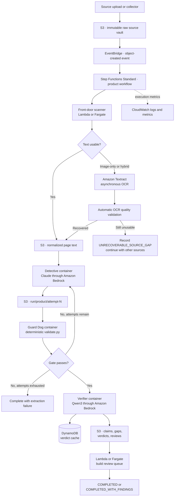

# AWS Reference Architecture: Evidence Extraction System

**Date:** 2026-08-24  
**Status:** Proposed AWS deployment architecture for the first production version  
**Companion build specification:** `docs/workorders/workorder-extraction-system-build.md`

## 1. Recommendation

Build the first AWS version around:

- Amazon S3 for immutable sources, normalized text, attempt artifacts, and evidence packs
- AWS Step Functions Standard for orchestration, bounded retries, and per-product execution
- Amazon ECS on AWS Fargate for the Detective, Guard Dog, and Verifier containers
- Amazon Bedrock for Claude extraction and Qwen cross-family verification
- Amazon Textract for automatic recovery of image-only and hybrid PDFs
- Amazon DynamoDB for verifier caching and idempotency records
- Amazon EventBridge, Amazon SQS, and AWS Lambda for short event-driven and control-plane tasks
- Amazon CloudWatch for operational logs and metrics

This is a bounded agentic architecture: the Detective has controlled autonomy,
while deterministic workflow states and validators control what advances.

Do not begin with EKS, Kafka, RDS, OpenSearch, or a large microservice estate.
They are unnecessary at the current scale.

## 2. System diagram



## 3. AWS service mapping

| Responsibility | AWS component | Notes |
|---|---|---|
| Immutable source vault | S3 | Enable versioning, KMS encryption, and lifecycle policies. |
| Generated artifacts | S3 | Store normalized page text, extraction attempts, verdicts, reports, and canonical packs under distinct prefixes. |
| Workflow initiation | S3 events through EventBridge | A new or revised manifest/source starts the relevant product workflow. |
| Workflow and retry control | Step Functions Standard | Use Standard workflows for durable history and long-running work. |
| Lightweight file classification | Lambda | MIME/signature checks, manifest validation, hashes, and routing. |
| Native PDF inspection | Lambda layer or Fargate | Use Fargate if PDF dependencies or execution duration exceed a comfortable Lambda footprint. |
| Image-only PDF recovery | Textract asynchronous document text detection | Process multipage PDFs from S3 without creating a routine human task. |
| Detective | Fargate container calling Claude through Bedrock | One task per product and attempt, with product-scoped IAM. |
| Guard Dog | Separate Fargate validator container | Keep the deterministic validator outside the Detective's writable runtime. |
| Verifier | Fargate container calling Qwen3 through Bedrock | Batch bindings and enforce provider throttling. |
| Verifier cache | DynamoDB | Use a complete semantic cache key; see §7. |
| Short report/queue generation | Lambda or Fargate | Lambda is sufficient if artifacts remain small. |
| Container images | Amazon ECR | Pin images by digest for reproducible runs. |
| Operational observability | CloudWatch | Logs, metrics, dashboards, and operational alarms only. |
| Failed asynchronous work | SQS dead-letter queues | Preserve failures for automated replay and diagnosis. |
| External credentials, if any | Secrets Manager | Not needed for model keys when both models run through Bedrock and IAM. |
| Infrastructure delivery | AWS CDK or Terraform | Deploy buckets, roles, queues, workflows, task definitions, and dashboards together. |

## 4. S3 layout and immutability

Use separate prefixes for source truth, working attempts, and accepted outputs:

```text
s3://evidence-system/
  source-vault/{product}/{source-sha256}/raw/{filename}
  source-vault/{product}/{source-sha256}/manifest.json
  normalized/{product}/{source-sha256}/pages/{page}.json
  normalized/{product}/{source-sha256}/document-text.txt
  workorders/{product}.json
  runs/{run-id}/{product}/attempt-1/
    claims.json
    gaps.json
    extraction-report.md
    validation.json
  runs/{run-id}/{product}/attempt-2/
  evidence-packs/{product}/
    claims.json
    gaps.json
    verdicts.json
    reviews.json
    review-queue.md
```

The Detective never writes directly to the canonical evidence-pack prefix. It
writes to an attempt prefix. The Guard Dog validates that attempt independently,
and the orchestrator promotes only a passing result.

Enable S3 versioning. Record the source object version, SHA-256, container image
digest, model ID, prompt version, and work-order version in every run report.

## 5. Stage 0: self-healing source intake

The front door should not reject a valid image-only manual or create a routine
human task. It classifies and repairs sources automatically.

### 5.1 Per-page classification

Classify each PDF page rather than sampling only the first pages:

- `TEXT_NATIVE_READY` — a usable native text layer exists.
- `OCR_REQUIRED` — the page is image-only or its text layer is unusable.
- `HYBRID` — the document contains both usable and unusable pages.
- `INVALID_SOURCE` — corrupt, encrypted without available credentials, or unsupported.

### 5.2 Automatic recovery

For `OCR_REQUIRED` or `HYBRID` pages:

1. Preserve the original PDF unchanged in S3.
2. Start asynchronous Textract text detection.
3. Write a page-aligned OCR sidecar containing lines, words, measured coordinates,
   confidence, engine/version, source hash, and original page number.
4. Validate page count, page mapping, text density, language plausibility,
   character quality, and missing-page coverage.
5. Apply stricter checks to numbers, units, warnings, negations, and procedural steps.
6. For weak passages, use a second OCR or Qwen3-VL comparison against the rendered
   page image.
7. If recovery succeeds, continue extraction against the sidecar.
8. If recovery remains unreliable, seek an alternative official source automatically.
9. If all recovery paths fail, record `UNRECOVERABLE_SOURCE_GAP` and continue with
   unrelated sources and claims.

No source-intake condition should page a person by default. An unrecoverable
source is a machine-recorded gap unless it makes the entire work order impossible.

## 6. Per-product Step Functions workflow

Use one child execution per product. At the initial five-product scale, a bounded
ordinary `Map` state is enough; Distributed Map is unnecessary.

```text
RegisterRun
  -> ValidateManifest
  -> InspectSources
  -> AutoRecoverTextIfNeeded
  -> PrepareAttempt
  -> RunDetective
  -> RunGuardDog
  -> Choice:
       pass                 -> RunVerifier
       fail + attempts left -> PrepareNextAttempt
       fail + exhausted     -> CompleteExtractionFailure
  -> BuildReviewQueue
  -> PublishRunReport
  -> Complete
```

### 6.1 Detective task

The Detective task:

- Downloads only the resolved product sources, work order, and standing brief.
- Uses an ephemeral local working directory.
- Calls a pinned Claude model through Amazon Bedrock.
- Writes only to its attempt prefix.
- Has no permission to modify source objects, canonical packs, validator images,
  other products, or previous attempts.
- Uploads its artifacts and exits.

### 6.2 Guard Dog task

Run `validate.py` in a separate signed container image and IAM role. It reads the
attempt and immutable sources, writes a validation report, and cannot modify the
attempt. Step Functions feeds its exact failure lines into the next Detective
attempt, up to the configured limit.

This separation prevents the agentic stage from modifying or bypassing the gate.

### 6.3 Promotion

After a successful gate result, copy or transactionally materialize the attempt
as the candidate pack for verification. Never promote a failed or incomplete
attempt.

## 7. Cross-family verifier

Use a pinned Qwen3 text model in Amazon Bedrock. This preserves the intended
family separation from the Claude Detective without sending evidence to an
external model gateway.

For low-confidence OCR-to-image comparisons, use a pinned Qwen3-VL model as a
separate visual check.

Store verifier cache entries in DynamoDB. A cache key must include at least:

```text
claim_id
binding_index
quote_sha256
canonical_translation_sha256
consequence_tier
model_id
prompt_version
verdict_schema_version
```

The translation hash is required because a changed object with an unchanged quote
must be reverified.

Batch calls inside the verifier task rather than creating one AWS workflow
execution per binding. At the current volume, a single product-scoped task with
bounded concurrency is simpler and cheaper.

## 8. Findings, alarms, and completion status

`MEANING_CHANGED` is a semantic priority flag, not an AWS operational alarm.

When found, the system should:

- Persist the verdict in `verdicts.json`.
- Print a prominent structured log entry.
- Count it in run telemetry.
- Put it first in the generated review queue.
- Finish with `COMPLETED_WITH_FINDINGS`.

It should not page someone, send an email, or prevent the orchestrator from
writing the remaining artifacts.

Reserve CloudWatch alarms for operational failures such as:

- Step Functions executions stuck or failed
- Exhausted Detective retries
- Bedrock or Textract service failures
- Corrupt or missing artifacts
- IAM denials
- SQS dead-letter queue growth
- Unexpected cost or invocation-rate spikes

Use distinct process outcomes:

| Outcome | Meaning |
|---|---|
| `0` | Verification completed with no meaning changes. |
| `2` | Verification completed with meaning-change findings. |
| `1` | Operational failure or incomplete verification. |

The orchestrator treats outcome `2` as a completed verifier run and continues to
queue/report generation.

## 9. Review and human involvement

The AWS workflow completes without waiting for a person. It produces candidate
packs, system auto-dispositions allowed by project policy, and an ordered queue
for claims that still require policy or high-consequence review.

Human review is outside the workflow's critical path. The system should not
create routine source-intake work for a person; source recovery is automated and
unrecoverable cases become explicit gaps.

If a user interface is later needed, add a small authenticated application using
CloudFront, Cognito, API Gateway, and Lambda. It is not required for the first
version; `review-queue.md` and `reviews.json` remain sufficient artifacts.

## 10. Security boundaries

Use a distinct IAM role for each stage:

- Intake: write raw/normalized objects, read manifests.
- Detective: read one product's sources/work order and write one attempt prefix.
- Guard Dog: read sources and attempts; write validation reports only.
- Verifier: read passing packs, invoke Qwen, access its DynamoDB cache, and write verdicts.
- Publisher: promote passing artifacts and build reports/queues.

Additional controls:

- KMS encryption for S3, DynamoDB, SQS, and logs.
- S3 gateway and Bedrock interface VPC endpoints where practical.
- No general outbound internet from model-processing tasks when all inference is
  through Bedrock.
- ECR image scanning and image-digest pinning.
- CloudTrail for control-plane activity.
- Structured logs must omit source content, quotes, credentials, and full prompts
  unless explicitly required in a protected diagnostic mode.

## 11. Observability and run record

Each run report should contain:

- Run ID, product, source hashes, and S3 object versions
- Work-order and brief hashes
- Attempts used and Guard Dog failure lines
- Claude and Qwen model IDs
- Prompt and schema versions
- Container image digests
- OCR-native/recovered/unrecoverable page counts
- Claim, gap, verdict, and review counts
- `ENTAILED`, `MEANING_CHANGED`, and `CANNOT_JUDGE` totals
- Token usage, model cost, Textract cost, and wall time by stage
- Final workflow status

Publish numeric metrics to CloudWatch and retain the complete immutable report in
S3 with the run artifacts.

## 12. CI/CD and infrastructure

Use GitHub Actions, CodeBuild, or CodePipeline to:

1. Run offline unit and injection tests.
2. Compile and lint `system/`, `scripts/`, and `evidence-packs/` Python code.
3. Build stage-specific container images.
4. Scan and push images to ECR.
5. Deploy infrastructure through CDK or Terraform.
6. Run a scratch-product integration test.
7. Promote pinned image digests to the production state machine.

Keep live-model semantic canaries separate from deterministic unit tests. Stub
Bedrock and Textract responses in ordinary CI; run controlled live canaries on a
schedule or explicit release gate.

## 13. Fargate versus AgentCore

Use Fargate for the first version because the existing Python scripts and Claude
agent harness can be containerized with minimal redesign.

Amazon Bedrock AgentCore Runtime is a reasonable later destination for the
Detective when session isolation, long-running agent execution, or managed agent
hosting becomes valuable. It should not be required to prove the initial system.

## 14. AWS references

- [Amazon Textract asynchronous document processing](https://docs.aws.amazon.com/textract/latest/dg/api-async.html)
- [Run ECS or Fargate tasks from Step Functions](https://docs.aws.amazon.com/step-functions/latest/dg/connect-ecs.html)
- [Claude in Amazon Bedrock](https://platform.claude.com/docs/en/build-with-claude/claude-in-amazon-bedrock)
- [Qwen models in Amazon Bedrock](https://docs.aws.amazon.com/bedrock/latest/userguide/model-cards-qwen.html)
- [Amazon Bedrock AgentCore Runtime](https://docs.aws.amazon.com/bedrock-agentcore/latest/devguide/agents-tools-runtime.html)

