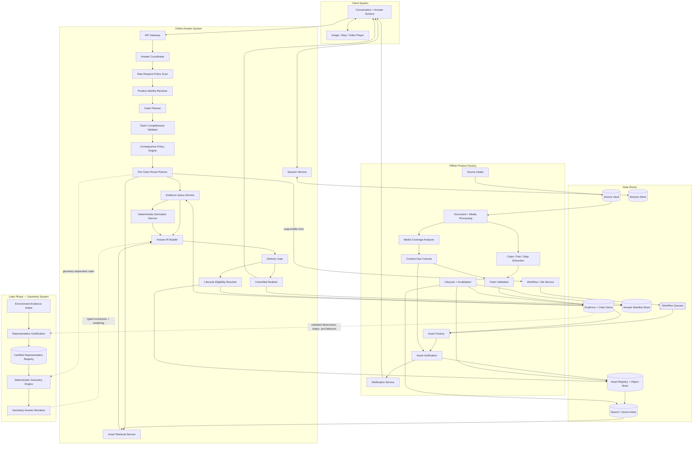
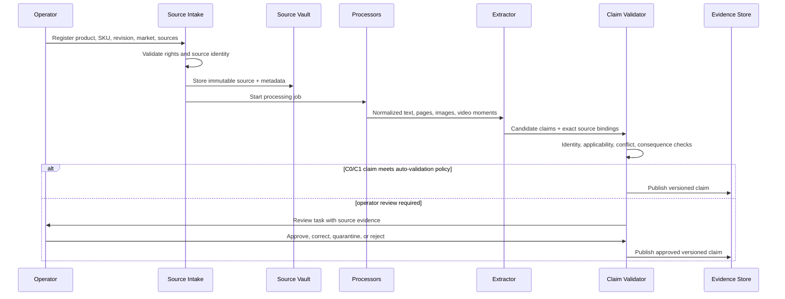
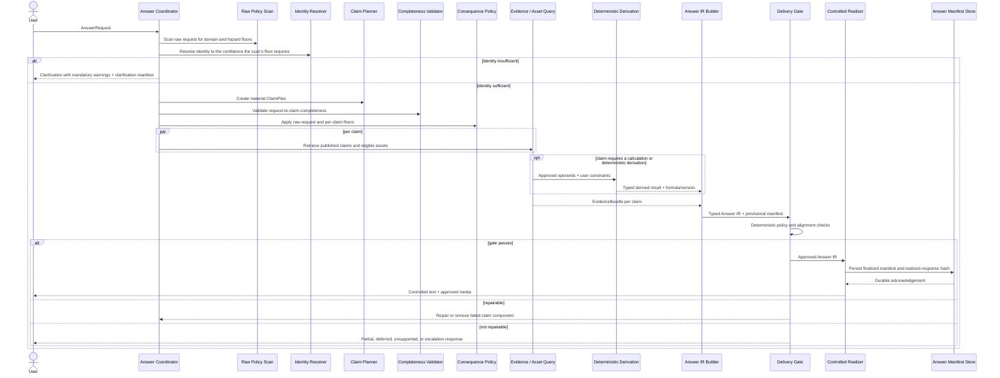
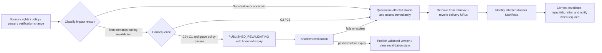
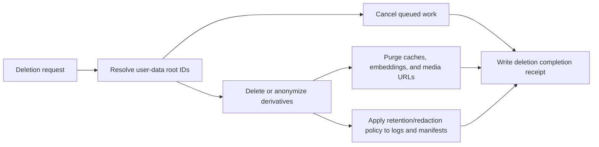
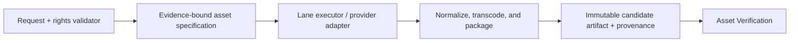
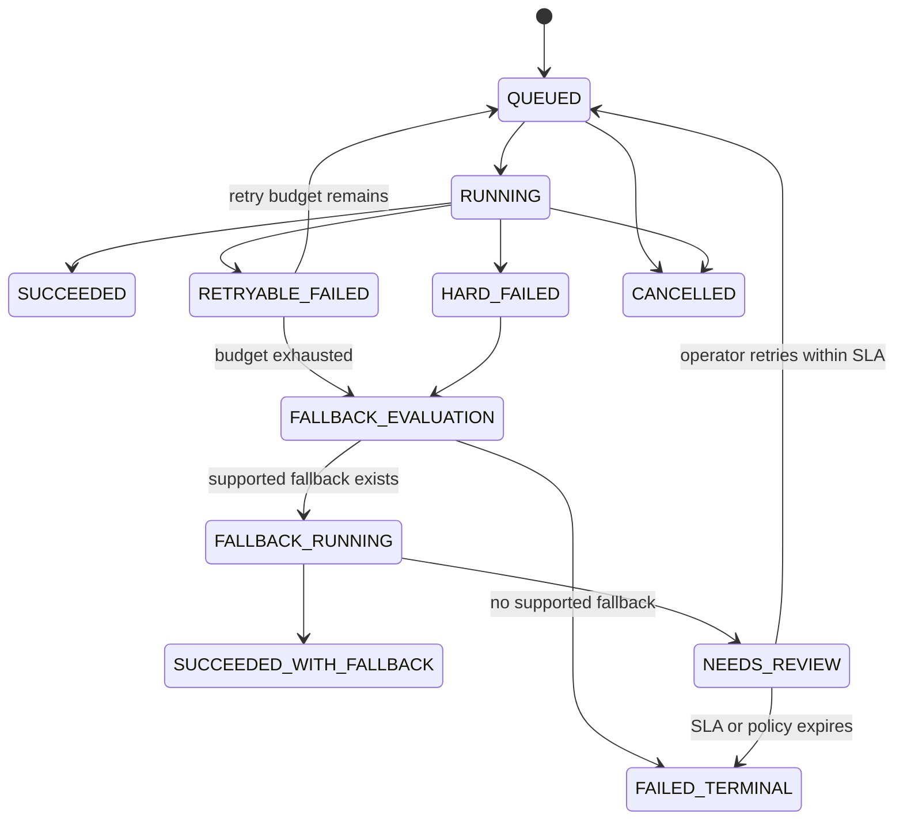
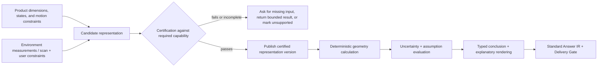

# ShowMe Low-Level Design

**Version:** 0.7

**Date:** 2026-08-20

**Status:** Draft for implementation review

**Scope:** P0 Text, Image, and Video answers

---

## 1. Purpose, scope, and document hierarchy

This document turns the ShowMe high-level architecture into implementable logical components and contracts.

Document hierarchy:

1. The product requirements define what ShowMe must do.
2. [`system-architecture.md`](./system-architecture.md) is the high-level product and architecture overview.
3. [`showme-system-architecture.md`](./showme-system-architecture.md) records the detailed architecture principles and roadmap.
4. This document defines component boundaries, flows, contracts, states, failure behavior, and test requirements.
5. Component-specific design documents may extend this LLD but must not contradict its contracts.

Where an overview document and this LLD disagree, this LLD governs until the overview is corrected.

### 1.1 P0 scope

P0 supports:

- exact product and variant context;
- verified factual text answers;
- exact static product visuals and callouts;
- illustrated step sequences;
- retrieved verified video segments;
- purpose-built video prepared and verified offline;
- multi-turn follow-ups;
- compound and mixed-format answers;
- assisted content review;
- source, claim, asset, and answer traceability;
- partial, deferred, unsupported, and safety-escalation responses.

P0 does not claim support for:

- arbitrary live generation of procedural video on the user request path;
- plausible inferred motion presented as an instruction;
- exact 3D fit, clearance, kinematics, collision, or physical simulation;
- free manipulation of unvalidated 3D representations.

The contracts deliberately reserve extension points for geometry and interactive rendering without requiring those capabilities in P0.

### 1.2 Non-negotiable implementation rules

1. A source artifact is not a published claim.
2. A generated asset is not a published asset.
3. A retrieved asset must match product identity, revision, rights, freshness, and claim applicability before relevance ranking.
4. A user request is decomposed into material claims; each claim receives its own route and consequence floor.
5. A generated procedural asset never enters the interactive response until it has completed offline verification and publication.
6. A purpose-built presentation may communicate supported facts in a new medium, but generation may not supply a missing fact or present unvalidated motion as established product behavior. Illustrative motion is permitted only in an explicitly labeled non-instructional transition and cannot support a procedural, compatibility, or geometry conclusion.
7. Final language is realized from a gated typed Answer IR, not accepted as unrestricted product prose.
8. Every delivered answer produces a durable, version-pinned Answer Manifest; required privacy erasure or redaction is recorded as a lifecycle event.
9. Every publish, stale, retire, and delete transition propagates to dependent records.
10. Existing video may be returned unmodified or trimmed when it completely answers the question; explanatory overlays on existing source video are not the primary answer strategy.

### 1.3 MVP exception — provisional serving of unverified generated video (time-boxed)

**Decision (2026-08-20, product owner):** for the MVP only, rules 2 and 5 of §1.2 are suspended for the video-generation miss path. When a video-route claim has no published asset, the freshly generated candidate is shown to the requesting user as soon as generation completes, **before any verification runs**. Rationale: the product's core appeal is seeing the video; a multi-day verified-delivery loop defeats the MVP.

This exception operates under the following conditions:

1. **Mandatory labeling.** The candidate is presented with a prominent, non-removable label: *"AI-generated — not yet checked against the manufacturer's manual. Follow the written steps if anything differs."* The verified fallback (text/illustrated steps) is delivered alongside it, never replaced by it.
2. **Consequence carve-out (recommended, pending product-owner confirmation):** C3 safety-critical claims (car-seat installation, harness threading) remain excluded and always follow the verified path of §1.2. POC evidence (0/3 correct folds in controlled Higgsfield runs; wrong-direction fold from Seedance) shows unverified procedural video is frequently believable-but-wrong.
3. **Provisional lifecycle state.** The candidate is stored as `CANDIDATE_PROVISIONAL`: servable only under this exception, always labeled, and re-servable to subsequent askers of the same question until offline verification completes. This state is an MVP-only addition to §9.2 and is removed when the exception sunsets.
4. **Offline verification still runs — after serving.** Every served candidate immediately enters the normal §7.5 verification ladder. Passing promotes it to `PUBLISHED` (label removed). Failing quarantines it, removes it from serving, and triggers a correction notification to every user whose Answer Manifest pins that candidate version.
5. **Manifest traceability.** Answers serving a provisional candidate record `provisional_unverified: true` and pin the exact candidate version, so affected users are identifiable for correction notices.
6. **Sunset condition.** The exception expires at the earlier of: (a) the automated VLM verification gate running inline in the generation job (POC-measured cost ~12–25 s and pennies per check, immaterial next to 3–7 min generation time — this is the intended first replacement), or (b) Phase 4 multi-product scale. After sunset, §1.2 applies unmodified.

Where the architecture overview documents state that "nothing generated is served before it passes verification," this section governs for the MVP period per the document hierarchy in §1.

---

## 2. High-level component map

The components below are logical boundaries. P0 may implement several boundaries in one deployable application while preserving the interfaces between them.



The dashed Geometry System boundary is an extension point, not a P0 deployable. Its detailed preconditions are summarized in §18 and require a separate component LLD.

---

## 3. End-to-end pipelines

### 3.1 Product onboarding and claim publication



The Evidence Store exposes only claim versions servable under §9.2 to online answering.

### 3.2 Online answer serving



### 3.3 Retrieval miss and deferred asset preparation

```mermaid
sequenceDiagram
    actor U as User
    participant A as Answer Coordinator
    participant J as Job Service
    participant F as Asset Factory
    participant V as Asset Verification
    participant L as Asset Library
    participant N as Notification Service

    A->>A: Claim is supported; required media is not published
    A-->>U: Immediate supported text/static fallback + deferred notice
    A->>J: Submit idempotent AssetPreparationRequest
    J->>F: Prepare candidate asset offline
    F->>V: Candidate asset + claims + provenance
    alt verification passes
        V->>L: Publish immutable asset version
        L->>N: asset.published event
        N-->>U: Answer asset is available
    else verification fails
        V->>J: Failure reason + consumed attempt/cost/time budget
        alt retry budget remains
            J->>F: Submit next bounded attempt
        else supported fallback exists
            J->>F: Prepare normal verified fallback lane
            J->>N: Publish AVAILABLE_WITH_FALLBACK when approved
            N-->>U: Illustrated/other fallback is ready; requested video was not produced
        else no publishable fallback
            J->>N: Terminal FAILED or owned NEEDS_REVIEW state
            N-->>U: Preparation could not complete
        end
    end
```

No candidate generated video is delivered directly from the Asset Factory.

Verification failure is a correction signal, not only a retry trigger. Structured failure reasons (wrong control, missing state, identity drift, absent label) are written into the next attempt's `AssetGenerationSpec`, or into an operator correction task where a human can trim, re-label, adjust the specification, or supply corrected inputs. A corrected candidate is always a new immutable candidate version and always re-enters verification before publication; corrections never edit a published asset in place.

### 3.4 Source correction and invalidation



A change is substantive when it may alter answer truth or permitted use: source bytes, product revision, applicability, authority/conflict resolution, recall, correction, rights, safety policy, or verification outcome. It is never eligible for grace-period serving.

`PUBLISHED_REVALIDATING` is allowed only for C0/C1 content after a non-semantic tooling change when the source hash, identity/applicability, rights, policy outcome, and prior verification evidence are unchanged. Its grace period is policy-controlled and must not exceed 48 hours. Expiry or any detected difference causes immediate quarantine. This prevents tooling migrations from taking the catalog offline without preserving information that may actually be wrong.

### 3.5 User-data deletion



### 3.6 User report and answer correction

```mermaid
flowchart LR
    REPORT["User reports wrong product, claim, step, media, or safety concern"] --> LOOKUP["Load Answer Manifest and exact versions"]
    LOOKUP --> TRIAGE{"Triage severity"}
    TRIAGE -- "Potentially unsafe or systemic" --> QUAR["Immediately quarantine affected asset or claim when policy requires"]
    TRIAGE -- "Ordinary quality issue" --> REVIEW["Create prioritized review task"]
    QUAR --> REVIEW
    REVIEW --> DECIDE{"Review decision"}
    DECIDE -- "Answer was correct" --> CLOSE["Close with rationale"]
    DECIDE -- "Correction required" --> CORRECT["Publish corrected source, claim, policy, or asset version"]
    CORRECT --> INVALIDATE["Run dependency invalidation and revalidation"]
    INVALIDATE --> NOTIFY["Notify affected users when policy requires"]
```



Reports never modify published content directly. They resolve through the same versioned correction, review, publication, and invalidation controls as other changes.

---

## 4. Initial deployable architecture

P0 should preserve logical boundaries without deploying every component as a separate microservice.

| Deployable | Included logical components | Scaling model |
|---|---|---|
| `showme-api` | API Gateway, Answer Coordinator, Identity Resolver, policy scan, Claim Planner, completeness validator, Route Planner, Evidence Query, Deterministic Derivation, Asset Retrieval, Answer IR Builder, Delivery Gate, Lifecycle Eligibility Resolver, Controlled Realizer, Session API | Horizontally scaled stateless instances; session data external |
| `showme-worker` | source processing, extraction, media analysis, asset preparation, verification automation, lifecycle propagation, deletion jobs | Queue-driven worker pools separated by workload class |
| `showme-ops` | claim review, conflict resolution, media coverage review, asset approval, staleness/recall review | Internal authenticated web application |
| `showme-notify` | deferred-answer notifications and status updates | Event-driven; may initially be a module of `showme-api` |
| Data plane | relational/graph data, object storage, search index, session store, queue, CDN | Managed services where appropriate |

Splitting a logical component into a service requires an explicit reason such as independent scaling, security isolation, latency isolation, or team ownership.

### 4.1 Client Experience System

The client is not a passive chat transcript. It has the following logical components:

| Component | Responsibility |
|---|---|
| Conversation surface | Capture the question, product context, constraints, clarification responses, and follow-ups. |
| Answer renderer | Render claim-level response states and mixed text, static visual, step-sequence, and video components without hiding partial or unsupported portions. |
| Media player | Provide pause, seek, replay, speed control, captions or transcript, step navigation, and keyboard/screen-reader support. |
| Context controller | Track the active product, variant, configuration, procedure step, viewpoint, and user constraints exposed by the Session Service. |
| Deferred-answer status | Show queued, preparing, reviewing, available, and failed states without presenting a candidate asset as complete. |
| Feedback reporter | Submit wrong-product, wrong-claim, wrong-step, misleading-media, and unsafe-answer reports with the current `answer_id`. |

The client must present critical conclusions, warnings, and required actions outside media alone. It must not infer task success from media playback or silently replace one product or variant with another.

---

## 5. Online Answer System

### 5.1 API Gateway

**Responsibilities**

- authenticate user or tenant;
- authorize product catalog and asset access;
- enforce request size, media type, and rate limits;
- assign `request_id`, `trace_id`, `tenant_id`, and idempotency key;
- validate the outer request schema;
- reject unsafe file types before internal processing.

**Inputs:** HTTP requests, optional uploads, session token.

**Outputs:** validated `AnswerRequest` or an API error.

**Failure behavior:** no internal component is invoked after authentication, authorization, or schema failure.

### 5.2 Answer Coordinator

**Responsibilities**

- own the request state machine;
- call each planning, policy, retrieval, IR, and gate component in order;
- enforce per-stage timeouts and total deadline;
- collect partial per-claim results;
- choose answer-now, clarify, partial, deferred, unsupported, or escalation state;
- persist the final Answer Manifest.

The coordinator must not contain product-domain rules. Those belong to versioned policy tables and claim data.

**Deterministic fast path.** A request may skip the model-based Claim Planner and the Layer 2 semantic completeness evaluation only when all of the following hold: product identity is already resolved from an explicit catalog or session selection; the request matches a versioned deterministic intent grammar as a single direct-fact intent with no compound, conditional, negation, comparison, or procedural markers; the raw-request policy scan returns C0/C1 with no mandatory clarification; and a published claim exactly matches the typed intent. Fast-path answers still pass the Consequence Policy Engine, Delivery Gate, and Controlled Realizer, and their manifests record `fast_path: true` with the grammar version. Any uncertainty falls back to the full pipeline.

### 5.3 Product Identity Resolver

**Inputs**

- raw-request policy scan output: minimum consequence floor and required identity attributes;
- explicit product ID, SKU, barcode, URL, or catalog context;
- session product identity;
- optional user image/video;
- user correction.

**Outputs**

```json
{
  "product_id": "prod_graco_ready2jet",
  "sku": "2212125",
  "revision": "2024_rev2",
  "market": "US",
  "confidence": 0.99,
  "evidence": ["catalog_selection"],
  "status": "RESOLVED"
}
```

**Rules**

- explicit user/catalog selection outranks visual similarity;
- identity must satisfy the minimum confidence required by the highest consequence floor;
- ambiguity affecting the answer produces a clarification;
- sibling variants are never substituted solely by semantic similarity;
- identity corrections invalidate affected planning and retrieval results.

### 5.4 Raw Request Policy Scan

The raw policy scan runs on the raw request text before identity resolution and claim planning: it needs no resolved identity, the identity resolver needs its floor to know the confidence it must meet, and a planner cannot omit the request's hazardous domain.

**Outputs**

- domain tags;
- minimum consequence floor;
- disallowed or escalation-only intents;
- mandatory warnings or questions;
- required identity attributes.

Example:

```json
{
  "domains": ["CHILD_RESTRAINT", "INSTALLATION"],
  "minimum_consequence": "C3",
  "required_identity": ["product_sku", "car_seat_sku", "market"],
  "mandatory_policy_ids": ["child_restraint_installation_v1"]
}
```

### 5.5 Claim Planner

The planner converts a user request into material claims without deciding whether those claims are true.

Example input:

> Can I use these headphones with this laptop, where is the port, and show me how?

Example output:

```json
{
  "claims": [
    {"claim_key": "c1", "intent": "COMPATIBILITY", "subject": "headphones", "object": "laptop"},
    {"claim_key": "c2", "intent": "PART_LOCATION", "part": "audio_port"},
    {"claim_key": "c3", "intent": "PROCEDURE", "action": "connect_headphones"}
  ],
  "request_relationships": [
    {"type": "DEPENDS_ON", "from": "c3", "to": "c1"},
    {"type": "DEPENDS_ON", "from": "c3", "to": "c2"}
  ]
}
```

### 5.6 Claim Completeness Validator

**Purpose:** confirm that the Claim Plan represents every material user intent and constraint.

The validator is independent from the Claim Planner and has two layers.

**Layer 1 — deterministic coverage enforcement**

- convert Raw Request Policy Scan output into required domain, hazard, identity, warning, and claim obligations;
- identify explicit quantities, product references, conditions, alternatives, exclusions, negations, and requested actions using versioned rules;
- require every obligation and material request span to map to one or more Claim Plan entries;
- verify dependency edges for statements such as “can I,” “without,” “before,” “after,” and “with this attached”;
- reject any plan that drops or weakens a deterministic obligation.

**Layer 2 — independent semantic completeness evaluation**

- use a separately versioned validator configuration that does not share the planner prompt or planner-produced reasoning;
- compare the raw request, normalized referents, deterministic obligations, and structured Claim Plan;
- return only a structured coverage map, uncovered spans, intent mismatches, and `PASS`/`FAIL`/`UNCERTAIN`;
- run deterministically or at low sampling variance; high-temperature sampling is prohibited for a gate decision;
- never override a Layer 1 failure.

**Combined checks**

- each noun/referent is resolved or marked unresolved;
- each requested action, comparison, condition, exclusion, and negation is represented;
- safety-relevant phrases from the raw policy scan appear in at least one claim;
- compound questions have multiple claims when required;
- unsupported subquestions are retained rather than silently dropped;
- the planner has not changed “can,” “should,” “how,” “where,” or “why” into another intent.

Both layer versions, their structured outputs, and the final decision are recorded in the Answer Manifest. If completeness cannot be established—or the layers disagree on a material C2/C3 obligation—the coordinator asks a clarification or takes the stricter route.

### 5.7 Consequence Policy Engine

The policy engine is deterministic and versioned.

```text
effective_consequence = max(
    raw_request_floor,
    per_claim_domain_floor,
    planner_requested_level
)
```

The planner may raise a consequence level and may not lower a policy floor.

Policy output includes:

- effective consequence level;
- required claim validation state;
- required asset verification state;
- required warnings/citations;
- human-approval requirement;
- permitted answer modes;
- permitted fallback modes.

### 5.8 Per-Claim Route Planner

The route planner selects a route independently for each material claim.

**Video-first rule for action intents (decision 2026-08-20, product owner).** The "least complex format first" hierarchy applies only to non-action intents. Any claim whose intent is an action the user performs — a discrete, continuous, or on-screen procedure — targets **video** as its ideal modality regardless of how briefly the action could be described in text; brevity never downgrades an action intent to text-only ("plug into the headphone jack" is a video, "how much does it weigh" is not). Pure facts, limits, policies, compatibility verdicts, and comparisons remain text-first. Every video answer still ships with its text/step equivalent for accessibility and immediate fallback, and per-lane evidence requirements are unchanged: this rule changes what we aim to show, not what we are allowed to show.

| Claim need | Primary route | Minimum support | Miss behavior |
|---|---|---|---|
| Direct fact | Text | Published applicable claim | Unsupported or clarify |
| Derived calculation | Text/hybrid | Published operands + approved deterministic formula | Clarify for missing inputs or mark unsupported |
| Part location | Exact static visual | Published location claim + eligible observed photo | Text location immediately; when no observed photo exists but the location claim has an exact source binding (e.g., a manual diagram region), defer a Lane B diagram-grounded visual; otherwise clarify |
| Appearance/state/context | Exact or purpose-built static visual | Published appearance/state claims at the required fidelity | Text immediately; defer new visual when useful |
| Ordered discrete procedure | Verified video (video-first rule); step sequence serves immediately | Published ordered steps and part locations; video additionally requires Lane D evidence | Steps/text immediately; defer video |
| Continuous physical procedure | Verified video | Published steps plus evidence establishing every depicted action, direction, control, and state change | Illustrated steps immediately; defer video |
| Digital/on-screen procedure | Purpose-built screen video (video-first rule); step sequence serves immediately | Published steps + applicable software/firmware/UI state | Text/steps immediately; defer video |
| Non-instructional transition | Labeled transition video | Validated endpoints; label mandatory | Static endpoints |
| Compatibility | Text/hybrid | Published compatibility claim for exact identities | Clarify or unsupported |
| Comparison | Text/table/hybrid | Comparable published claims with matched conditions | Partial comparison with missing dimensions exposed |
| Diagnosis | Clarification tree | Published symptom checks and safe actions | Escalate or unsupported |
| Compound question | Hybrid | Support assessed per claim | Partial answer with explicit unresolved claims |
| Geometry/fit | Reserved later-phase route | Validated geometry and environment record | State that exact fit is unavailable in P0 |

The diagnosis clarification tree is orchestrated by the Answer Coordinator over Session state using published symptom-check claims; it introduces no separate online component. Its detailed design belongs to `answer-orchestration-lld.md`.

### 5.9 Evidence Query Service

**Responsibilities**

- query only claims in a servable lifecycle state as defined in §9.2;
- enforce product, SKU, revision, market, state, and effective-date applicability;
- return exact source bindings;
- expose conflicts and coverage gaps;
- provide structured values rather than generated prose.

### 5.10 Deterministic Derivation Service

This service produces a new conclusion only when an approved calculation or rule can operate on published claim values and explicit user constraints.

**Responsibilities**

- select an allowlisted formula or decision rule by typed intent;
- validate units, product state, measurement conditions, required operands, and tolerance compatibility;
- perform deterministic unit conversion and calculation;
- propagate source uncertainty and distinguish exact, bounded, estimated, and unsupported results;
- return the formula ID/version, operands, assumptions, result, and error bound as typed data;
- refuse the derivation when a required operand or applicable rule is missing.

It does not estimate an unknown product fact. Geometry, collision, clearance, kinematics, electrical suitability, and other specialized conclusions require a capability-specific engine and validation policy rather than a general-purpose language model calculation.

### 5.11 Asset Retrieval Service

Eligibility filters run before relevance ranking:

1. tenant/catalog access;
2. exact product/SKU/revision/market;
3. lifecycle state is servable under §9.2 for the claim consequence and current time;
4. rights permit current use and display context;
5. asset consequence ceiling satisfies claim consequence;
6. asset modality and claim bindings match;
7. source and asset freshness;
8. only then exact and semantic relevance ranking.

The retrieval response includes a coverage map showing which required claims and steps the asset answers.

### 5.12 Answer IR Builder

The builder combines supported per-claim results into a typed representation. It does not generate unrestricted prose.

```json
{
  "answer_id": "ans_01J...",
  "request_id": "req_01J...",
  "identity": {
    "product_id": "prod_graco_ready2jet",
    "sku": "2212125",
    "revision": "2024_rev2",
    "market": "US"
  },
  "response_state": "PARTIAL",
  "claims": [
    {
      "claim_key": "c1",
      "claim_id": "claim_compatibility_123",
      "claim_version": 4,
      "intent": "COMPATIBILITY",
      "status": "SUPPORTED",
      "conclusion": {
        "operator": "COMPATIBLE",
        "value": true,
        "certainty": "CONFIRMED"
      },
      "applicability": {
        "sku": "2212125",
        "revision": "2024_rev2",
        "state": null,
        "market": "US"
      },
      "source_ids": ["src_manual_2024_p12"],
      "consequence": "C2",
      "assumptions": [],
      "warnings": [],
      "presentation_bindings": ["asset_photo_port_v3"]
    },
    {
      "claim_key": "c3",
      "intent": "PROCEDURE",
      "status": "DEFERRED",
      "deferred_job_id": "job_video_456",
      "immediate_fallback": "VERIFIED_STEP_SEQUENCE"
    }
  ],
  "realization_policy": "conclusion_first_v1"
}
```

`response_state` is a closed enumeration: `ANSWERED`, `PARTIAL`, `CLARIFICATION`, `DEFERRED`, `UNSUPPORTED`, `ESCALATION`, `TEMPORARY_FAILURE`. Coordinator, gate, realizer, and client all use this enumeration; no component introduces additional states.

### 5.13 Delivery Gate

The delivery gate validates the structured Answer IR before language or media URLs are released.

Before evaluating rules, the gate issues one logical `BatchResolveEligibility` request containing every pinned claim and asset version, tenant/rights context, and a single requested `as_of` timestamp. The Lifecycle Eligibility Resolver performs set-oriented reads against each authoritative registry in parallel and returns lifecycle, applicability, rights, freshness, consequence ceiling, per-registry snapshot watermark, and current-version results. Sequential per-reference lookups are prohibited on the normal path. A co-located registry may use one transaction snapshot; separated registries must expose watermarks so the resolver can reject an unknown or excessively lagged composite result.

A cache or read replica may accelerate this operation only when it has push-based invalidation/revocation, a policy-bounded maximum age, and authoritative fallback. A cache cannot convert an unknown or unavailable state into eligible. Failure of the batch check fails the gate closed.

**Required checks**

- request-to-claim completeness result passed;
- raw and per-claim consequence floors applied;
- every supported claim references a currently servable claim version;
- identity/applicability alignment;
- required citations, warnings, and approvals present;
- every media binding is published, eligible, fresh, and rights-cleared;
- media claim/step/state coverage satisfies the route;
- transition and illustrative labels present when required;
- unsupported and deferred material claims remain visible;
- realization policy is approved for the consequence level.
- derived conclusions reference an approved formula version, published operands, explicit assumptions, and the required uncertainty state.

The gate returns `PASS`, `REPAIRABLE_FAILURE`, or `HARD_FAILURE` with machine-readable reasons.

Clarification, deferred-status, and terminal-status responses are gated too: they pass a reduced profile that checks mandatory warnings from the raw policy scan, absence of unbound product claims, and approved realization templates, and each produces a lightweight manifest recording what was asked or reported and why.

### 5.14 Controlled Realizer

The realizer receives only a gated Answer IR.

**Rules**

- direct conclusions are generated from typed operators and values;
- units, conditions, warnings, and uncertainty come from IR fields;
- prose may improve readability but may not add product claims;
- media URLs are resolved only after the delivery gate passes;
- high-consequence answers use constrained templates;
- streaming is permitted only from an already gated IR;
- required actions and critical warnings are available in text and are not communicated through audio, motion, or color alone;
- video bindings include an accessible transcript or equivalent step sequence;
- the realized response or its content hash is written to the Answer Manifest.

### 5.15 Session Service

Stores:

- active product and revision;
- user-supplied constraints;
- current answer and claim references;
- active procedure and step;
- pending deferred jobs;
- presentation state.

The session includes an entity-binding stack rather than only free-form conversation history:

```json
{
  "active_variant_id": "sku_2212125",
  "active_configuration_id": "cfg_open_with_belly_bar",
  "entity_bindings": [
    {
      "entity_type": "PART",
      "entity_id": "part_thumb_switch",
      "surface_id": "surface_handle_left",
      "source": "USER_SELECTED_VISUAL_REGION",
      "answer_id": "ans_01J...",
      "confidence": 1.0,
      "bound_at": "2026-08-19T22:10:00Z"
    }
  ],
  "last_demonstrated_step_id": "step_02_handle_squeeze",
  "active_candidate_set": ["part_latch_left", "part_latch_right"]
}
```

Reference resolution precedence is: explicit entity or user correction, direct UI selection, current procedure/visual binding, then recency-scored conversational binding. Terms such as “the other one” resolve only inside a typed candidate set with a unique remaining member. “That latch,” “zoom there,” or a step reference must bind to a graph entity and current product state; ambiguity causes a focused clarification. Every resolution records its source and confidence in the new Answer Manifest.

Any follow-up that changes identity, state, configuration, or constraints invalidates affected prior route results and produces a new Answer Manifest.

### 5.16 Pre-generation clarification gate

**Decision (2026-08-20, product owner):** vague requests are resolved *with the user, before* generation spends money — and, under the §1.3 MVP exception, before an unverified video is served. Example: "connect Bose headphones to Mac" leaves headphone model, Mac model, and wired-vs-Bluetooth open; a video generated on guesses is wasted budget at best and a confidently wrong provisional video at worst.

**Rules**

1. **Gate placement.** No `AssetPreparationRequest` may be submitted while any attribute the prospective `AssetGenerationSpec` pins — SKU/variant/revision, connection method, OS/app/firmware version, starting configuration or mechanical state, locale — is unresolved or guessed. The gate sits after claim planning and before job submission; it also runs before final modality routing so a clarified answer re-plans cleanly.
2. **Structured multiple-choice clarification.** Clarification is presented as multiple choice, never as an open text question. Options are enumerated from typed catalog and claim data (variant lists, published connection methods, supported OS versions), so each tap binds directly to a spec field with no interpretation step and is guaranteed to have published evidence behind it. A free-text "other / not listed" escape is present but never required. At most one clarification round per request; attributes already bound in the session's entity-binding stack are not re-asked.
3. **Assume-and-declare (C0/C1 only).** If the user does not or cannot answer, the coordinator picks deterministically — session evidence first, then a versioned default policy (e.g., most-common variant in catalog data) — and declares the pick prominently in the answer: *"Showing: QuietComfort Ultra → MacBook Air M3, Bluetooth. Not your setup? Tap to change."* Every pick is recorded in the Answer IR `assumptions` field and the Answer Manifest. A correction tap re-plans the request and re-queues generation under a new idempotency key; the superseded assumption-based asset is not reused for the corrected identity.
4. **C2/C3: no assumptions.** Attributes the raw policy scan marks as required identity may never be assumed. The response remains `CLARIFICATION` until the user confirms them. Guessing which car seat a user owns is the wrong-product failure this system exists to prevent, not a UX shortcut.
5. **Clarification narrows the spec; it never downgrades modality.** Per the video-first rule (§5.8), an action intent stays a video after clarification even when the clarified answer could be stated in one sentence.

---

## 6. Product Evidence System

### 6.1 Source Intake

**Responsibilities**

- register product, SKU, revision, market, and source relationship;
- acquire or accept source artifacts;
- verify file type and basic integrity;
- record source URL, acquisition date, authority, and rights;
- calculate content hash;
- prevent duplicate ingestion;
- submit a processing job.

### 6.2 Source Vault

Stores immutable originals and derived artifacts.

Immutable means an artifact is never overwritten while retained. A permitted privacy or rights deletion removes the protected payload and leaves only the policy-approved tombstone and audit receipt.

Every artifact carries:

- `source_id` and immutable version;
- parent artifact ID for derivatives;
- content hash;
- product applicability;
- acquisition metadata;
- rights vector;
- user-data root ID when applicable;
- lifecycle state.

### 6.3 Document and Media Processors

Logical processors:

- PDF/text extraction with page and bounding-region coordinates;
- OCR for scanned documents;
- image normalization while preserving originals;
- video probing, shot/scene segmentation, keyframes, timestamps, and audio transcript;
- table extraction with row/column provenance;
- language and market detection.

All processors are sandboxed and treat source content as data rather than executable instruction.

### 6.4 Claim Extractor

Produces candidate records for:

- facts and specifications;
- parts and controls;
- product states;
- ordered procedure steps;
- dimensions and measurement conditions;
- compatibility relationships;
- warnings and prerequisites;
- care rules;
- warranty and market conditions.

Each candidate includes exact source spans and the extractor version.

### 6.5 Claim Validation Service

Performs:

- schema and unit checks;
- product/variant/revision applicability checks;
- source-authority evaluation;
- duplicate and equivalence detection;
- contradiction detection;
- consequence-floor assignment;
- auto-validation eligibility;
- operator-review task creation.

Auto-publication is allowed only when every condition below passes:

1. the claim is C0/C1 and its claim type/predicate is explicitly allowlisted by a versioned auto-validation policy;
2. the source is an allowlisted first-party authority for that claim type, such as an official product page or manufacturer specification table;
3. product, variant, revision, market, configuration, and effective-date applicability are exact or explicitly source-wide;
4. the extracted value has an exact source span and passes a deterministic type, unit, range, and normalization parser;
5. two independently configured extraction passes agree on the normalized value and applicability, or one extraction agrees with a deterministic table/field parser;
6. no conflicting source, warning, recall, low-confidence identity, or unresolved applicability exists;
7. the claim is directly stated—not inferred, calculated, or filled from a sibling product;
8. the claim is not a compatibility/approval relationship, procedural action, safety warning/limit, diagnostic conclusion, or dimension intended for fit or clearance.

Extraction agreement checks transcription reliability; it does not create independent product evidence or resolve a source conflict. Every auto-published claim records the policy version, both extraction/parser results, source binding, and reason codes. Failure of any condition routes the candidate to review.

C2/C3 claims and excluded C0/C1 claim types may not become `PUBLISHED` through extraction alone.

### 6.6 Evidence Query Model

Claims are immutable versioned records. A simplified record:

```json
{
  "claim_id": "claim_weight_limit_123",
  "version": 2,
  "type": "LIMIT",
  "subject": "prod_graco_ready2jet",
  "predicate": "maximum_child_weight",
  "object": {"value": 50, "unit": "lb"},
  "applicability": {
    "sku": "2212125",
    "revision": "2024_rev2",
    "market": "US",
    "state": null
  },
  "source_bindings": [
    {"source_id": "src_manual_2024", "page": 5, "region": [0.12, 0.41, 0.78, 0.52]}
  ],
  "authority": "MANUFACTURER_MANUAL",
  "consequence_ceiling": "C3",
  "status": "PUBLISHED",
  "extractor_version": "claim-extractor-0.3.0",
  "validated_by": "operator_456",
  "published_at": "2026-08-19T20:00:00Z"
}
```

---

## 7. Media and Asset System

### 7.1 Media Coverage Analyzer

Maps source media to published claims and procedure steps.

For video, the coverage record includes:

- product identity confidence;
- start/end timestamps;
- visible parts and controls;
- demonstrated actions;
- initial/intermediate/final states;
- omitted required steps;
- occlusions or ambiguity;
- maximum supported consequence level.

The analyzer proposes coverage. Publication requires the verification level demanded by policy.

### 7.2 Asset Preparation Request

```json
{
  "job_id": "job_video_456",
  "idempotency_key": "sha256:...",
  "product_identity": {
    "sku": "2212125",
    "revision": "2024_rev2",
    "market": "US"
  },
  "required_claim_ids": ["claim_step_1", "claim_step_2", "claim_step_3"],
  "requested_asset_type": "PROCEDURAL_VIDEO",
  "required_coverage": {
    "ordered_steps": ["claim_step_1", "claim_step_2", "claim_step_3"],
    "initial_state": "OPEN",
    "final_state": "FOLDED"
  },
  "consequence": "C1",
  "rights_constraints": ["GENERATE_FROM_ALLOWED", "DISPLAY_PUBLIC_ALLOWED"]
}
```

The `idempotency_key` is the SHA-256 of a canonical encoding of tenant, product identity (SKU, revision, market), `requested_asset_type`, the ordered `required_claim_ids` with their pinned versions, `required_coverage`, consequence, and rights constraints. A claim republication therefore produces a new key and a new job rather than silently reusing output prepared for superseded claims.

### 7.3 Asset Generation Specification and Adapter Contract

All generated-media lanes compile an `AssetGenerationSpec` before invoking an external or internal executor. The specification is provider-neutral and immutable per attempt.

```json
{
  "spec_id": "ags_01J...",
  "spec_version": "1.0",
  "job_id": "job_video_456",
  "attempt_id": "attempt_02",
  "lane": "PROCEDURAL_VIDEO",
  "recipe_id": "recipe_procedural_video_pin3_v4",
  "identity": {"sku": "2212125", "revision": "2024_rev2", "market": "US"},
  "claim_bindings": ["claim_step_1", "claim_step_2", "claim_step_3"],
  "input_assets": [
    {"asset_id": "asset_open_view_v2", "role": "START_STATE"},
    {"asset_id": "asset_folded_view_v4", "role": "END_STATE"}
  ],
  "required_states": ["OPEN", "MID_FOLD", "FOLDED_LOCKED"],
  "motion_constraints": [
    {"claim_id": "claim_step_1", "subject": "thumb_switch", "action": "SLIDE", "direction": "FORWARD"}
  ],
  "presentation": {
    "width": 1280,
    "height": 720,
    "duration_ms_max": 8000,
    "frame_rate": 24,
    "camera_policy": "FIXED_UNLESS_EVIDENCE_REQUIRES_CHANGE",
    "locale": "en-US"
  },
  "prohibited_content": ["NEW_CONTROLS", "OMITTED_REQUIRED_ACTIONS", "IDENTITY_CHANGE"],
  "verification_policy_id": "asset-video-procedure-v1",
  "execution_budget": {"max_attempts": 2, "max_cost_minor": 1000, "currency": "USD", "deadline_at": "2026-08-20T02:00:00Z"},
  "fallback_lanes": ["ILLUSTRATED_STEP_SEQUENCE", "TEXT_ONLY"]
}
```

`input_assets` contain registry references, never durable provider URLs. The adapter resolves rights-cleared, short-lived inputs only at submission time.

Every executor adapter implements:

| Operation | Contract |
|---|---|
| `GetCapabilities` | Return supported media types, conditioning roles, limits, regions, and effective model/version identifiers. |
| `ValidateSpec` | Reject unsupported or rights-incompatible specifications before cost is incurred. |
| `SubmitAttempt` | Submit one idempotent attempt and return the external operation reference plus effective/echoed parameters. |
| `GetAttempt` | Return normalized state, progress, cost, provider metadata, and failure reason. |
| `CancelAttempt` | Best-effort cancellation with a final auditable state. |
| `CollectCandidate` | Store immutable result bytes, hashes, effective settings, provenance, and usage data as a `CANDIDATE`; never publish. |

Provider responses and echoed parameters are untrusted input. The adapter persists the intended specification, effective settings, model/provider version, input hashes, output hash, timing, cost, region, and failure reason for every attempt.

`recipe_id` names the versioned generation recipe the spec was compiled from — pin configuration, prompt template, camera policy, provider, and tier. Recipes are managed under §7.8; a recipe change is a versioned policy change, never a silent prompt edit.

**Bounded fallback rule:** a video job may not remain indefinitely pending. When its configured attempt, cost, or deadline budget is exhausted, it transitions to fallback evaluation. If published ordered steps support Lane C, the workflow reuses an eligible published step sequence or creates and verifies a Lane C candidate. A verified fallback produces `AVAILABLE_WITH_FALLBACK` and a notification that an illustrated answer—not a requested video—is ready. If no fallback can be published, the job reaches a terminal `FAILED` or `NEEDS_REVIEW` state with an operator SLA and a user-visible terminal update. A fallback is never auto-published without its normal verification.

### 7.4 Asset Factory lanes

These are internal production sub-lanes within the architecture documents' three user-facing answer formats; they do not introduce additional user-facing modalities.

| User-facing lane (architecture docs) | Factory lane(s) here |
|---|---|
| Lane 1 — Text & Facts | None; served directly from published claims |
| Lane 2 — Photo callouts and appearance visuals | Lane A (exact static visual), Lane B (purpose-built visual) |
| Lane 2 — Animated step cards | Lane C (illustrated procedure sequence) |
| Lane 3 — Video demonstration | Lane D (procedural video), Lane E (labeled transition) |

Every lane uses the same internal pipeline:



The evidence-bound specification lists the claims to communicate, product identity, required and prohibited visual details, step/state coverage, permitted fidelity, consequence level, rights constraints, and acceptance checks. A provider adapter may change presentation but may not add support to that specification.

#### Lane A — Exact static visual

- start from an eligible observed product image;
- apply crop or callout using a validated part region;
- preserve product identity and state;
- never infer an unobserved part location.

#### Lane B — Purpose-built appearance or context visual

- communicate an already supported appearance, state, or relationship in a new static composition;
- enforce the required product identity and fidelity level;
- label conceptual or approximate context rather than implying exact scale, fit, clearance, or an observed viewpoint;
- preserve which features are observed and which are not confirmed in a novel viewpoint;
- may depict a part location or configuration established by a published claim with an exact source binding (such as a manual diagram region) even when no observed photo exists; the output is labeled as diagram-derived rather than presented as an observed photograph;
- the depicted fact must come from the published claim in every case — a location, control, or relationship never comes from model inference, and absence of any claim-backed evidence refuses the visual rather than approximating it;
- never use visual plausibility to establish compatibility, geometry, or behavior.

#### Lane C — Illustrated procedure sequence

- start from published ordered steps and diagrams;
- create one card/frame per action or observable state;
- retain claim binding per card;
- communicate discrete steps without inventing continuous motion.

#### Lane D — Procedural video

- retrieve an existing complete verified segment when available;
- otherwise prepare purpose-built video offline;
- every required action and state must be supported;
- every depicted control, direction, motion path, intermediate state, and result must be established by approved evidence or a validated behavioral representation;
- an existing source video is not required when the underlying actions and product details are established by other approved evidence;
- partial evidence may produce illustrated steps or a labeled transition, not a plausible instruction;
- the output remains `CANDIDATE` until asset verification publishes it.

For digital/on-screen procedures, the asset specification also pins the applicable operating-system, application, firmware, locale, and starting UI state. For physical procedures, it pins the relevant product configuration and mechanical state.

#### Lane E — Non-instructional transition

- use only validated endpoints;
- treat any unvalidated motion between endpoints as illustrative rather than observed product behavior;
- label the output as a transition;
- never bind it to a procedural claim;
- never imply omitted user actions are unnecessary.

### 7.5 Asset Verification

Verification layers:

1. deterministic checks: identity, rights, file integrity, duration, required labels, claim and step bindings;
2. automated content checks: product consistency, part/control visibility, ordered coverage, state consistency;
3. operator review according to consequence and instruction policy;
4. publish transaction only after all required approvals pass.

Any instruction requires human approval in P0. C2/C3 assets require consequence-appropriate human approval even when non-instructional.

### 7.6 Asset Record

```json
{
  "asset_id": "asset_fold_video_123",
  "version": 3,
  "type": "PROCEDURAL_VIDEO",
  "status": "PUBLISHED",
  "identity": {
    "sku": "2212125",
    "revision": "2024_rev2",
    "market": "US"
  },
  "claim_bindings": [
    {"claim_id": "claim_step_1", "time_range_ms": [0, 1100]},
    {"claim_id": "claim_step_2", "time_range_ms": [1100, 2300]},
    {"claim_id": "claim_step_3", "time_range_ms": [2300, 5000]}
  ],
  "presentation_cues": {
    "duration_ms": 5000,
    "caption_track": {
      "asset_id": "asset_fold_video_123_captions_en_v1",
      "format": "WEBVTT",
      "language": "en-US",
      "kind": "CAPTIONS"
    },
    "transcript_asset_id": "asset_fold_video_123_transcript_en_v1",
    "step_markers": [
      {"start_ms": 0, "end_ms": 1100, "label": "Slide thumb switch", "claim_id": "claim_step_1"},
      {"start_ms": 1100, "end_ms": 2300, "label": "Squeeze handle lever", "claim_id": "claim_step_2"},
      {"start_ms": 2300, "end_ms": 5000, "label": "Collapse frame", "claim_id": "claim_step_3"}
    ]
  },
  "consequence_ceiling": "C1",
  "rights": {
    "display_public": true,
    "display_tenant": true,
    "expires_at": null
  },
  "verification": {
    "policy_version": "asset-video-procedure-v1",
    "automated_result": "PASS",
    "operator_approval_id": "approval_789"
  },
  "source_ids": ["src_manual_2024", "src_official_video_2024"],
  "published_at": "2026-08-19T22:00:00Z"
}
```

Caption and transcript references are versioned assets with their own rights and lifecycle state; delivery URLs are created only after the Delivery Gate. Step markers must be ordered, fall within duration, and bind to the same published claims as the video ranges. These cues are player-level accessibility and navigation metadata—not text burned into or overlaid on existing source footage. When a video contains no meaningful audio, a transcript may be replaced by the equivalent verified step sequence, but critical actions must still be available outside motion alone.

### 7.7 Asset publication consistency

Publication uses an immutable version plus a transactional outbox:

1. the publish transaction re-verifies that every bound claim version is currently servable under §9.2 and fails otherwise, then writes the asset version and `PUBLISHED` state;
2. write `asset.published` outbox event in the same transaction;
3. indexer consumes event and writes search/vector records;
4. retrieval considers only versions whose registry state is servable under §9.2;
5. delivery gate re-checks registry state even after retrieval;
6. stale/retire events remove index eligibility and revoke or purge delivery URLs.

### 7.8 Generation learning loop

**Decision (2026-08-20, product owner):** offline verification verdicts are reusable learning signal for generation, not only per-attempt correction feedback (§3.3). Three loops, priority-ordered; companion plan: `digital-twin-phase-plan.md` Decision 9.

1. **Recipe learning.** Every `AssetGenerationSpec` pins a versioned `recipe_id` (§7.3). An offline aggregation job joins verification verdicts (pass and fail) to recipes and maintains pass-rate tables per lane × product category. The best-performing recipe per lane/category is promoted through a versioned policy change with the pass-rate evidence attached. Recipes encode the empirically discovered rules — disable provider prompt rewriting, zero unrequested motion effects, product-only reference images, keyframe pinning with shared ground line and matched angles — so learning survives provider swaps.
2. **Verifier calibration precondition.** A verdict signal may drive automated recipe promotion or any model training only after it is benchmarked against human labels and meets a reliability threshold; signals below threshold (currently: mechanism-correctness verdicts) require human labels. This prevents optimizing generation toward fooling the verifier rather than toward correctness.
3. **Hard-negative library.** Every rejected candidate is retained with its structured failure reason and serves as (a) a permanent regression suite for the verifier — known-bad videos must stay rejected across verifier versions — and (b) optional negative exemplars for generation prompts.

Generator fine-tuning is out of P0 scope: it is bounded by provider capability and the rights vector (`generate_from`, `send_to_provider`), scales at category level rather than per SKU, and is re-evaluated only if the digital-twin path leaves generation owning motion.

---

## 8. Content-Ops System

### 8.1 Review queues

Queue types:

- claim conflict;
- low-confidence identity/applicability;
- C2/C3 claim approval;
- procedure-step approval;
- media coverage approval;
- generated asset approval;
- stale/recall remediation;
- failed or exhausted job.

### 8.2 Review workbench

The workbench shows:

- candidate claim or asset;
- exact product identity;
- relevant source page, region, image, or video timestamp;
- conflicting sources;
- applicable consequence policy;
- required hard-failure checklist;
- approve, correct, quarantine, reject, stale, and retire actions;
- complete immutable review history.

### 8.3 Reviewer authorization

- reviewer role controls maximum consequence approval;
- C3 approval policy may require an appropriately qualified or dual reviewer;
- reviewers cannot approve assets outside their tenant/catalog scope;
- all decisions record reviewer, timestamp, policy version, and rationale.

---

## 9. Workflow, Events, and Lifecycle System

### 9.1 Job states



User-visible states are `QUEUED`, `PREPARING`, `REVIEWING`, `AVAILABLE`, `AVAILABLE_WITH_FALLBACK`, `NEEDS_REVIEW`, `FAILED`, and `CANCELLED`. An internal parked/review state must have an owner and SLA and may not appear as an indefinite pending spinner.

### 9.2 Claim and asset lifecycle states

| State | Servable? | Meaning |
|---|---|---|
| `DRAFT` / `CANDIDATE` | No | Extracted or generated but not approved. |
| `IN_REVIEW` | No | Awaiting required validation or approval. |
| `PUBLISHED` | Yes | Current and eligible subject to identity, rights, applicability, and consequence checks. |
| `PUBLISHED_REVALIDATING` | C0/C1 only | Prior published version undergoing bounded shadow revalidation after an eligible non-semantic tooling change. |
| `QUARANTINED` | No | Immediately blocked because truth, applicability, rights, safety, or verification may have changed. |
| `STALE` | No | Superseded or failed freshness/revalidation requirements. |
| `RETIRED` | No | Intentionally withdrawn and retained for audit. |
| `DELETED` | No | Protected payload removed; only the permitted tombstone remains. |

Retrieval may return `PUBLISHED_REVALIDATING` only when the consequence is C0/C1, `grace_period_expires_at` has not passed, and the Delivery Gate batch check confirms the revalidation reason remains eligible. C2/C3 content and substantive changes never use this state.

### 9.3 Core events

| Event | Producer | Required consumers |
|---|---|---|
| `source.ingested` | Source Intake | processors, audit |
| `claim.extracted` | Claim Extractor | validation |
| `claim.published` | Claim Validation | evidence index, coverage analysis, invalidation |
| `claim.revalidation_started` | Lifecycle Service | revalidation workers, evidence index, audit |
| `claim.stale` | Lifecycle Service | asset invalidation, retrieval index, manifest impact analysis, workflow/job service (cancel or park in-flight asset jobs bound to the claim) |
| `asset.requested` | Answer Coordinator / operator | Asset Factory |
| `asset.candidate_ready` | Asset Factory | Asset Verification |
| `asset.published` | Asset Verification | search index, notification |
| `asset.fallback_started` | Workflow Service | fallback lane, notification/audit |
| `asset.stale` | Lifecycle Service | search removal, URL purge, manifest impact analysis |
| `answer.delivered` | Answer Coordinator / Controlled Realizer | manifest store, analytics |
| `report.created` | Feedback API | report triage, audit |
| `user_data.delete_requested` | Privacy API | deletion orchestrator |
| `user_data.delete_completed` | deletion orchestrator | privacy receipt, audit |

### 9.4 Event requirements

- at-least-once delivery;
- idempotent consumers;
- immutable event ID;
- tenant and trace context;
- schema version;
- causation and correlation IDs;
- bounded retries and dead-letter handling;
- no event payload contains unnecessary raw user media.

### 9.5 Notification Service

The Notification Service consumes published-asset and workflow-status events and sends only policy-permitted messages to the requesting user or tenant channel.

- notification preferences and destination tokens are stored separately from asset jobs;
- the payload references the answer/job and does not expose licensed source content;
- duplicate events are collapsed with an idempotency key;
- notification delivery failure never changes asset publication state;
- opening a notification starts a new online retrieval and Delivery Gate check rather than trusting the historic event payload;
- terminal failure or cancellation is communicated without claiming that an answer asset exists.

---

## 10. Public and Internal APIs

### 10.1 Public APIs

| Method | Path | Purpose |
|---|---|---|
| `POST` | `/v1/answers` | Start an answer request |
| `GET` | `/v1/answers/{answer_id}` | Read answer status and current result |
| `POST` | `/v1/answers/{answer_id}/follow-ups` | Ask a contextual follow-up |
| `GET` | `/v1/jobs/{job_id}` | Read deferred preparation status |
| `POST` | `/v1/reports` | Report wrong product, claim, step, media, or safety concern |
| `DELETE` | `/v1/user-data/{root_id}` | Request deletion of user-provided data and derivatives |

`POST /v1/answers` accepts an idempotency key. Repeated requests with the same tenant, user, and key return the same request result.

### 10.2 Internal service APIs

| Command | Purpose |
|---|---|
| `RegisterSource` | Create source metadata and processing job |
| `PublishClaimVersion` | Publish an approved immutable claim version |
| `SubmitAssetPreparation` | Create idempotent asset job |
| `PublishAssetVersion` | Publish an approved immutable asset version |
| `BatchResolveEligibility` | Resolve lifecycle, applicability, rights, freshness, and consequence eligibility for all pinned claim/asset versions in one consistent read |
| `MarkDependencyStale` | Begin dependency invalidation |
| `BeginShadowRevalidation` | Enter bounded `PUBLISHED_REVALIDATING` only after reason and consequence policy passes |
| `RecordReviewDecision` | Store immutable operator decision |
| `RequestUserDataDeletion` | Start deletion workflow |

All internal calls use service authentication and tenant authorization. Write commands additionally use optimistic version checks and audit logging; eligibility reads return registry watermarks and fail closed on missing references or excessive lag.

---

## 11. Data ownership and consistency

| Data | System of record | Consistency rule |
|---|---|---|
| Source metadata and rights | Source Vault metadata | Immutable versions; rights changes create new effective version |
| Claims | Claim Registry / Evidence Store | Only immutable versions servable under §9.2 may be returned |
| Assets | Asset Registry | Object bytes immutable by version; lifecycle and revalidation reason stored transactionally |
| Search/vector documents | Retrieval Index | Derived; rebuildable; never authoritative |
| Answer IR and manifests | Manifest Store | Append-only, subject to privacy retention/redaction policy |
| Sessions | Session Store | Ephemeral with explicit TTL |
| Jobs | Workflow Store | State transitions use compare-and-set / optimistic concurrency |

### 11.1 Storage technology mapping (MVP decision, 2026-08-20)

The logical stores map to concrete services as follows. This resolves the first three §20 open decisions for the MVP; the logical contracts above are unchanged by any later substitution.

| Logical store (LLD) | What it needs | MVP choice | Scale-up / alternatives |
|---|---|---|---|
| Source Vault (immutable originals) | Cheap durable blobs, versioning, hash-addressable | S3 with versioning + object lock (or GCS) | Cloudflare R2 (no egress fees), Backblaze B2 |
| Evidence Graph / Claim Registry | Transactions, versioned rows, lifecycle states, relational queries (SKU→revision→claims) | PostgreSQL (RDS/Aurora) — claims as versioned rows; the "graph" is FKs + a few join tables | Neo4j only if traversal queries dominate (they won't in P0); Postgres handles product→variant→part→step fine |
| Asset Registry (metadata) + asset bytes | Transactions for publish + outbox; bytes elsewhere | Same Postgres for records; S3 for bytes | Keeping registry+claims in one DB gives you the §7.7 publish transaction for free |
| Search / Vector Index | Semantic + keyword retrieval; derived, rebuildable | pgvector in the same Postgres + Postgres full-text | OpenSearch/Elasticsearch (hybrid search at scale); Qdrant/Weaviate/Pinecone/Turbopuffer if vector volume outgrows pgvector (~10M+ vectors — years away) |
| Answer Manifest Store (append-only receipts) | Durable append, read-by-id, retention/redaction | Postgres table (append-only discipline), archived to S3 after N days | DynamoDB if write volume gets huge; S3 + Athena for the archive tier |
| Session Store | Fast KV, TTL | Redis (ElastiCache/Valkey) | Managed Redis anywhere; even Postgres works at MVP traffic |
| Workflow Queues | At-least-once jobs, retries, DLQ | SQS (+ a worker loop), or a Postgres-backed queue (`SELECT ... FOR UPDATE SKIP LOCKED`) at MVP scale | Temporal when job orchestration gets complex (multi-step generation with budgets/fallbacks maps nicely to it); Kafka only if event volume justifies it |
| Events / outbox | Transactional outbox → consumers | Outbox table in Postgres + a relay to SQS/SNS | EventBridge, Kafka later |
| Media delivery (published serving copies) | Signed URLs, revocable, fast start | CloudFront over S3 with signed URLs | Any CDN (Fastly, Cloudflare); Mux if we want per-title video packaging/ABR |

**Why co-location is the design, not a shortcut:** the §7.7 publish transaction (asset version + outbox event atomically) requires claims, assets, and outbox in one transactional database; the Delivery Gate's `BatchResolveEligibility` (§5.13) becomes a single-snapshot indexed query, which this section's co-located registry is explicitly permitted to use; and "the index is never authoritative" (§11.2) is structurally enforced when pgvector rows sit beside the registry rows they point to, letting retrieval join the eligibility check into the query itself.

### 11.2 Publish rule

No object becomes user-eligible by being present in object storage or a search index. Eligibility is determined by the authoritative registry lifecycle state and §9.2 servability rules, then re-checked by the Delivery Gate.

### 11.3 Version pinning

Every Answer Manifest pins:

- claim versions;
- asset versions;
- identity resolution result;
- raw-request and per-claim policy versions;
- planner/completeness-validator versions;
- calculation version when applicable;
- Answer IR schema version;
- delivery-gate and realization-policy versions;
- delivery timestamp.

---

## 12. Security, rights, and privacy

### 12.1 Rights vector

Rights are evaluated for each operation:

```json
{
  "store": true,
  "transform": true,
  "send_to_provider": false,
  "generate_from": false,
  "display_public": false,
  "display_tenant_ids": ["tenant_123"],
  "retention_until": "2027-08-19T00:00:00Z",
  "attribution_required": true
}
```

When an asset combines sources, its effective rights are the intersection of all source rights plus any derivative-specific restriction.

### 12.2 Security boundaries

- all public and internal calls authenticated and authorized;
- tenant ID included in every data access path;
- source parsers and media decoders isolated;
- remote URL acquisition allowlisted and protected against SSRF;
- raw source content treated as untrusted data, not planner instruction;
- provider responses treated as untrusted candidate data;
- secrets stored outside job payloads and logs;
- asset delivery uses expiring signed URLs where required;
- audit logs cover publishing, approval, delivery gate, rights denial, and deletion.

### 12.3 Privacy

- user media is separated from catalog data;
- retention is explicit and minimal;
- raw user media is not reused for catalog asset generation without separate consent;
- derivatives retain the originating user-data root ID;
- deletion cancels jobs and propagates through objects, indexes, caches, sessions, logs, manifests, and review artifacts subject to legal retention;
- evaluation datasets require explicit inclusion policy and de-identification.

---

## 13. Reliability and failure behavior

| Failure | Required behavior |
|---|---|
| Identity unresolved | Ask focused clarification; do not retrieve sibling assets |
| Planner timeout | Return safe clarification or supported deterministic fast-path fact |
| Policy service unavailable | Fail closed to stricter consequence handling |
| Claim store unavailable | Return temporary failure; do not answer from unverified cache |
| Retrieval index unavailable | Use exact registry lookup; otherwise text-only/temporary fallback |
| Asset object unavailable | Remove media component and return supported remaining claims |
| Delivery gate failure | Repair, degrade, defer, or reject; never bypass |
| Batch eligibility check unavailable or incomplete | Fail the Delivery Gate closed; never substitute index state for authoritative eligibility |
| Manifest store unavailable | Do not deliver a new answer unless its manifest and gate result can be durably recorded or queued through an approved transactional fallback |
| Generation executor unavailable or repeatedly fails verification | Consume the bounded budget, evaluate verified fallback lanes, and reach `AVAILABLE_WITH_FALLBACK`, `NEEDS_REVIEW`, or terminal `FAILED`; never remain indefinitely pending |
| Verification unavailable | Candidate assets remain non-published |
| Notification failure | Asset remains published; notification retries independently |
| Lifecycle propagation delayed | Delivery gate authoritative recheck blocks stale content |
| Shadow revalidation reaches grace expiry | Quarantine the version and dependent assets before further delivery |
| Queue saturation | Prioritize user-requested work; suspend speculative preparation |

All failures emit structured reason codes and trace context.

---

## 14. Observability

### 14.1 Required identifiers

- `trace_id` across online and offline work;
- `request_id` and `answer_id`;
- `tenant_id` and privacy-safe user reference;
- `claim_id`/version and `asset_id`/version;
- `job_id` and idempotency key;
- policy, schema, planner, verifier, and gate versions.

### 14.2 Metrics

Online:

- latency by stage and response state;
- identity clarification rate;
- request-to-claim completeness failure rate;
- route distribution by claim type;
- retrieval hit/miss and eligibility rejection reasons;
- delivery-gate pass/repair/hard-fail rates;
- partial/deferred/unsupported/escalation rate;
- stale-asset rejection rate;
- Delivery Gate batch size, cache age, fallback rate, and latency;
- accessible-alternative availability and media-control error rate;
- user-report rate and time to safety triage.

Offline:

- ingestion and extraction success rate;
- claim auto-validation and operator-review rate;
- review time and backlog by consequence;
- asset generation and verification pass rate, overall and by recipe version (§7.8);
- attempts, cost, and elapsed time before fallback by lane/executor;
- fallback success, needs-review, and terminal-failure rate;
- cost per published asset;
- job retry, park, and dead-letter counts;
- invalidation propagation time;
- deletion completion time.

Quality:

- independently reviewed claim accuracy;
- product identity precision;
- procedure-step completeness;
- wrong-SKU retrieval rate;
- user correction/report rate;
- unsafe or materially misleading answer rate.

### 14.3 Logging

- structured logs only;
- no raw user media or unrestricted document text in standard logs;
- sensitive values tokenized or redacted;
- decision logs include reason codes rather than hidden chain-of-thought;
- audit and operational logs have separate retention policies.

---

## 15. Performance targets

Targets are provisional until PR-N01 is ratified and measured.

| Time mark | Initial target | Notes |
|---|---:|---|
| Request acknowledgement | `< 300 ms` | Client-visible state change |
| Exact deterministic fact path | `< 1.5 s` p95 | Includes auth, identity, policy, claim lookup, gate, realization |
| Standard retrieved answer | `< 5 s` p95 | Includes planner and mixed-format retrieval |
| Delivery Gate batch eligibility read | `< 25 ms` p95 | Up to 25 pinned claim/asset versions, same region; provisional budget |
| Media playback start after answer | `< 2 s` p95 | Published/CDN-hosted assets |
| Deferred job acknowledgement | `< 2 s` p95 | Does not include media preparation |

No unverified media generation is awaited during these online budgets. The exact-deterministic-fact target applies only to fast-path-eligible requests as defined in §5.2; requests that engage the model-based planner and Layer 2 completeness evaluation fall under the standard retrieved-answer target.

---

## 16. Testing strategy

### 16.1 Unit tests

- identity confidence and sibling rejection;
- consequence floor lookup;
- deterministic and independent semantic claim-completeness layers;
- entity-binding and “other one” ambiguity rules;
- rights intersection;
- C0/C1 auto-validation allowlist and exclusion rules;
- lifecycle transitions;
- delivery-gate reason codes;
- Answer IR realization templates;
- deterministic derivation formulas, unit handling, and uncertainty propagation;
- idempotency and optimistic concurrency.

### 16.2 Contract tests

- API and event schemas;
- Claim Record, Asset Record, Answer IR, and Manifest compatibility;
- provider adapter submission/response audit;
- generation-spec capability negotiation, idempotency, budget, and fallback contracts;
- retrieval eligibility before semantic ranking;
- single-batch Delivery Gate eligibility resolution and fail-closed behavior;
- publish outbox and index synchronization;
- WebVTT/transcript/step-marker lifecycle and rights bindings;
- signed URL authorization.

### 16.3 Golden scenario tests

Minimum Phase 0 set:

- simple factual answer;
- exact part-location answer;
- derived answer with pinned operands, formula version, units, and assumptions;
- purpose-built contextual visual that cannot imply exact geometry;
- compound headphone question routed to text + image + video/deferred;
- digital/on-screen procedure pinned to the correct software and starting state;
- incomplete existing video producing illustrated fallback and deferred video;
- exhausted video budget producing a verified illustrated fallback and terminal user-visible status;
- transition never accepted as instruction;
- wrong SKU asset rejected despite high semantic similarity;
- identity ambiguity causing clarification;
- C3 request receiving deterministic floor and human-approved content only;
- planner omission caught by completeness validator;
- deterministic completeness failure cannot be waived by the semantic validator;
- ambiguous “other latch” reference causes clarification instead of arbitrary selection;
- C0/C1 non-semantic revalidation uses a bounded grace state, while source correction quarantines immediately;
- unsupported claim retained in the answer;
- stale asset rejected after retrieval but before delivery;
- rights-denied asset rejected;
- generated candidate never retrieved;
- realization cannot invert a typed conclusion;
- source correction invalidates claims and assets;
- user-data deletion reaches all derivatives;
- every delivered video has the required accessible alternative and playback metadata;
- verification failure feedback produces a corrected next attempt, and the corrected candidate re-enters verification before publication;
- an in-flight asset job is cancelled or parked when a bound claim is quarantined or goes stale;
- a clarification response carries mandatory raw-scan warnings and records a clarification manifest;
- a fast-path-ineligible request (compound, negated, or C2/C3) always engages the full planner and completeness pipeline;
- a part-location question with no observed photo but a published diagram-bound location claim returns the text location immediately and defers a diagram-grounded Lane B visual; the same question with no claim-backed location evidence refuses visual generation instead of approximating;
- a vague action request ("connect Bose headphones to Mac") produces exactly one multiple-choice clarification whose options come from typed catalog data, and no generation job is enqueued until its spec attributes are resolved;
- an unanswered C0/C1 clarification proceeds with a declared, manifest-recorded assumption, and a correction tap re-queues generation under a new idempotency key; the identical situation at C2/C3 remains a `CLARIFICATION` response;
- an action intent answerable in one sentence still routes to video (video-first rule), with the text equivalent delivered alongside.

### 16.4 End-to-end tests

- product onboarding to cited factual answer;
- claim review to publication;
- published static asset to exact part-location answer;
- retrieval miss to deferred preparation, approval, publication, and notification;
- report wrong answer to retirement and retrieval exclusion;
- service degradation paths from §13.

### 16.5 Release gates

- no P0/C3 production answer without required human approval;
- zero wrong-SKU results in the release identity/retrieval suite;
- zero delivery of candidate/stale/retired assets;
- zero unbound product claims in realized responses;
- all golden scenarios pass;
- security and privacy checks pass for enabled input modes.

---

## 17. Implementation sequence

### Phase 0 — Contracts and executable rulebook

- finalize schemas for AnswerRequest, ClaimPlan, ClaimRecord, AssetRecord, Answer IR, Answer Manifest, and events;
- implement raw request policy, consequence floors, and completeness test fixtures;
- implement delivery-gate rules as executable tests;
- define source-authority and review policy;
- establish repository modules and dependency rules.

Exit: golden routing and gate suite passes without external AI or media generation.

### Phase 1 — Verified text spine

- Source Intake, Vault, processors, candidate claim extraction;
- claim validation and basic Content-Ops review;
- published Evidence Query;
- identity resolution for one explicit catalog SKU;
- Answer IR, Delivery Gate, Controlled Realizer, and Answer Manifest;
- cited text answers and correction/retirement flow.

Exit: one product answers approved factual questions with full provenance and rejects unsupported or mismatched questions.

### Phase 2 — Exact static and illustrated answers

- media processing and observed-view records;
- exact static asset lane;
- illustrated step sequence lane;
- asset registry, verification, publication, retrieval, and URL delivery;
- hybrid answers and persistent session state.

Exit: part-location and discrete-step questions are served from published assets with correct claim bindings.

### Phase 3 — Retrieved and purpose-built video

- video segmentation and claim/step coverage;
- complete existing-video retrieval;
- deferred purpose-built video jobs;
- video verification and operator approval;
- notification and follow-up serving.

Exit: no procedural video is served without complete step coverage and required approval; misses return an immediate supported fallback.

### Phase 4 — Catalog and operational scale

- multi-tenant/catalog controls;
- review prioritization and capacity controls;
- invalidation and deletion at scale;
- quotas, backpressure, disaster recovery, and cost dashboards;
- expand golden scenarios across categories.

Exit: 10+ products operate within agreed quality, latency, cost, and review-SLA targets.

### Phase 5 — Geometry and interactive extension

- environment evidence schema;
- validated geometry/capability records;
- uncertainty-aware fit calculations;
- representation certification envelope;
- interactive/rendered answer bindings.

This phase requires its own component LLD before implementation.

---

## 18. Geometry extension boundary

Geometry-dependent answers remain part of the product direction but are not implemented by the P0 media pipeline. A later-phase geometry route adds these logical components:

| Component | Responsibility |
|---|---|
| Environment Evidence Intake | Capture user constraints, measurements, images/scans, applicable state, coordinate frame, confidence, and privacy root. |
| Representation Candidate Builder | Produce or import a candidate product/environment representation; candidate appearance alone has no answer authority. |
| Representation Certification Service | Validate identity, real-world scale, dimensions, openings, independent parts, allowed states, kinematics, and a declared capability envelope. |
| Certified Representation Registry | Store immutable certified versions, validation measurements, tolerances, limitations, rights, and lifecycle state. |
| Deterministic Geometry Engine | Compute orientation, bounds, collision, clearance, articulation, and maneuver path only within the certified envelope. |
| Uncertainty and Assumption Evaluator | Propagate measurement uncertainty and classify the conclusion as exact, bounded, estimated, or unsupported. |
| Geometry Answer Renderer | Produce an interactive or rendered view bound to the typed conclusion; it communicates the result but does not establish it. |



The certification envelope is capability-specific. A representation certified for external dimensions is not automatically valid for collision, folding kinematics, required force, stability, electrical behavior, or any other untested property. Exact fit also requires applicable geometry for the user's environment, openings, desired orientation, maneuver path, closure state, and agreed tolerance—not merely a recognizable product model.

## 19. Required follow-on component designs

Create a component design before implementing each complex subsystem:

1. `answer-orchestration-lld.md`
2. `claim-and-evidence-lld.md`
3. `asset-factory-and-verification-lld.md`
4. `content-ops-lld.md`
5. `workflow-and-invalidation-lld.md`
6. `security-rights-privacy-lld.md`
7. `geometry-and-fit-lld.md` before Phase 5

Each component document must include APIs, schemas, algorithms or decision tables, state transitions, failure behavior, observability, tests, and operational runbooks.

---

## 20. Open implementation decisions

- ~~primary relational/graph data technology~~ — resolved for MVP: PostgreSQL (§11.1);
- ~~queue/workflow engine~~ — resolved for MVP: Postgres-backed queue or SQS, Temporal as scale-up (§11.1);
- ~~search and vector technology~~ — resolved for MVP: pgvector + Postgres full-text (§11.1);
- source-processing and OCR libraries;
- model/provider choices for extraction, planning, media analysis, and generation;
- tenant and catalog model for launch;
- identity confidence thresholds;
- source-authority precedence;
- exact consequence-floor table;
- reviewer qualifications and dual-review rules;
- notification channels;
- initial product-identification input modes;
- purpose-built video presentation policy: narration, visual callouts, both, or product motion alone;
- supported languages and localization policy;
- retention and residency values;
- final SLO, RPO, RTO, and cost ceilings.

These choices may change implementation technology without changing the component contracts in this document.
