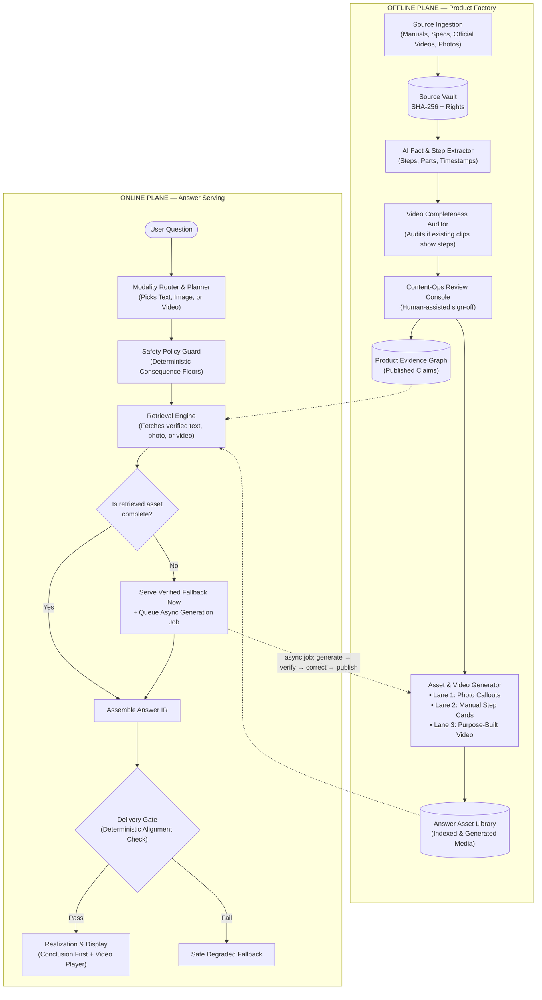
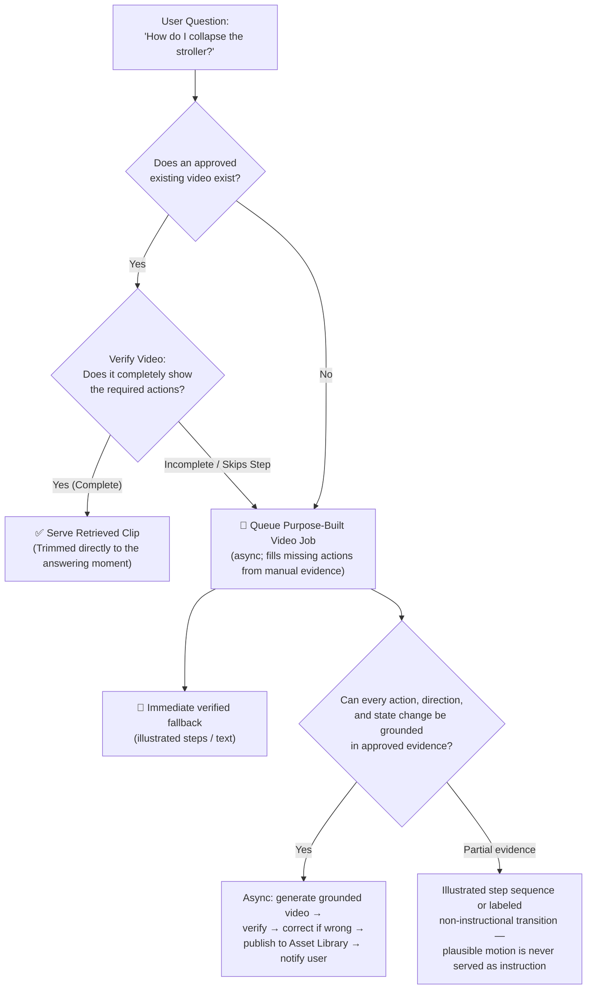
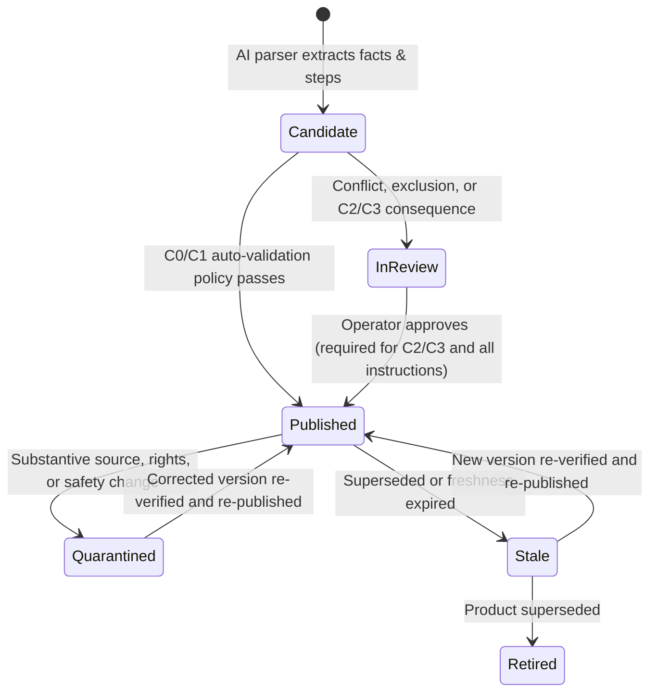
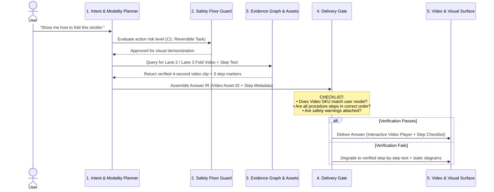

# ShowMe End-to-End System Architecture

**Version:** 3.1  
**Date:** 2026-08-19  
**Status:** Approved Technical Architecture Blueprint  
**Role:** Architecture principles and roadmap. Exact contracts are defined in [low-level-design.md](./low-level-design.md); where the two differ, the LLD governs.  

---

## 1. Executive Summary & Design Principles

ShowMe is a product-understanding system that **answers user questions using the simplest, most effective truthful format: Text, Image, or Video**.

Instead of forcing users to read thick instruction manuals or hunt through 20-minute video reviews, ShowMe delivers direct, verified answers.

### The Two Core Operational Principles:

1. **The Modality Hierarchy (Least Complex Format First):**
   * 📝 **Text First:** If a question is basic and direct (specs, dimensions, warranty, rules), answer in concise text.
   * 🖼️ **Image Next:** If a question requires locating a part or checking visual appearance, show a photo with clear callouts.
   * 🎥 **Video When Needed:** If an answer requires seeing motion, direction, or step-by-step physical action, show a video demonstration.

2. **The Retrieval-First, Then-Generation Rule:**
   * For **every modality** (Text, Image, or Video), **retrieve existing approved content first**.
   * **Verify completeness:** Check if the retrieved content completely and accurately answers what the user asked.
   * **Generate when missing or incomplete:** If existing content is absent or skips essential steps, generate the answer **asynchronously** (image callouts, step animations, or purpose-built video clips): the user gets a verified fallback immediately; the generated asset is verified — and corrected if wrong — offline, then published to the Answer Asset Library and announced. Nothing generated is served before it passes verification.

```
                      THE CORE SHOWME PHILOSOPHY
  ┌───────────────────────────────────────────────────────────────────┐
  │  1. Pick simplest format:  Text ──► Image ──► Video               │
  │  2. For that format:       Retrieve First ──► Verify Completeness │
  │                                           ──► Generate if Missing │
  └───────────────────────────────────────────────────────────────────┘
```

---

## 2. Core Architectural Principles

| # | Principle | Operational Meaning |
|---|---|---|
| **P1** | **Truth originates in structured state, never in an ungrounded pixel model.** | Facts, part names, step orders, and measurements come from validated claims in the Evidence Graph; generative AI only communicates and animates. |
| **P2** | **Retrieval-First Video Pipeline.** | When an answer needs motion, search official/PDP footage first. If the footage skips steps or is missing, queue an async purpose-built clip: generated offline, verified, corrected when wrong, and published to the Asset Library before it is ever served. Every depicted motion must be grounded in approved evidence; ungrounded motion is never served as instruction. |
| **P3** | **Two Planes (Factory vs Serving).** | An offline *Product Factory* prepares, indexes, verifies, and generates assets; an online *Answer Plane* serves verified answers in bounded time with deterministic safety gates. |
| **P4** | **Claims and assets are lifecycle objects.** | Extracted facts are candidates until validated; verified assets carry provenance and are invalidated by any upstream source change. |
| **P5** | **Layered verification ending at the Delivery Gate.** | Deterministic checks $\to$ VLM first pass $\to$ Human review for all instructional media in P0 (always for $C_2/C_3$) $\to$ Deterministic delivery gate on every assembled Answer IR. |
| **P6** | **P0 focus on Visual & Video Demonstration over 3D Physics.** | Deep 3D kinematic mesh rigging and collision modeling are scoped to Phase 5 / exploratory (due to immature automated image-to-3D tooling). P0 focuses squarely on visual video demonstrations and step animations. |
| **P7** | **Identity discipline before relevance.** | Exact SKU, variant, and revision matching precedes semantic retrieval. Sibling models are never silently merged. |
| **P8** | **Consequence floors are deterministic code.** | Safety floors ($C_0$ to $C_3$) are evaluated via deterministic policy tables before and after claim planning. The planner may raise consequence, never lower it below the policy floor. |
| **P9** | **Typed Answer Intermediate Representation (Answer IR).** | Conclusions travel as typed structured values, not raw prose. Language realization can only verbalize approved IR fields. |

---

## 3. High-Level System Architecture



---

## 4. The Video Decision Engine (Retrieve &rarr; Verify &rarr; Generate)

When an answer requires motion or a physical procedure, the system executes the following decision logic:



---

## 5. Data Backbone & Storage

| Store | Technology / Format | Contents & Purpose | Key Discipline |
|---|---|---|---|
| **Source Vault** | Object Storage (S3/GCS) | Immutable original artifacts (PDF manuals, spec sheets, official videos, photos) with SHA-256 hash keys. | Per-source **Rights Vector** (store, transform, generate-from, display). |
| **Product Evidence Graph** | Graph / Relational DB | Products $\to$ Variants $\to$ Revisions $\to$ Parts, States, Ordered Steps, and Dimensions. | Stores discrete **Claim Records** with lifecycle states (`Extracted`, `Validated`, `Published`, `Stale`). |
| **Answer Asset Library** | Object Storage + Metadata DB | Verified photos with callouts, animated step cards, and purpose-built video clips. | Indexed by SKU, Revision, Claim IDs answered, and Verification Records. |
| **Answer Manifest Store** | Document DB / Append Log | One manifest per delivered answer recording exact claim versions, asset IDs, assumptions, consequence levels, and delivery gate results. | Complete audit trail for compliance, replay evaluations, and invalidation cascades. |
| **Session Store** | Fast KV (Redis) | Conversational context, active product, selected configuration, current procedure step, and UI surface state. | Enables multi-turn follow-ups (*"Where is that latch?"*, *"Show that step again"*). |

---

## 6. Offline Plane: The Product Factory

### 6.1 Claim Lifecycle & Assisted Review Console

Extraction output is a **candidate**, not ground truth. Claims move through an explicit state machine:



The authoritative lifecycle table (including `PUBLISHED_REVALIDATING` and `DELETED`) is LLD §9.2; this diagram is the simplified view.

### The Assisted Review Workbench
To prevent human review from becoming a scaling bottleneck, the Content-Ops console auto-highlights the exact manual diagram beside the extracted claim:

```
  ┌────────────────────────────────────────────────────────────────────────┐
  │                 OPERATOR VERIFICATION WORKBENCH                        │
  ├────────────────────────────┬───────────────────────────────────────────┤
  │ [Retrieved Content Audit]  │ [Manual Ground Truth]                     │
  │ Modality: Video / Folding  │  ┌──────────────────────────────────────┐ │
  │ Existing Clip: 'promo.mp4' │  │ Page 8, Figure 3: Folding Mechanism │ │
  │ Segment: 00:14 - 00:18     │  │ [=== HIGHLIGHTED DIAGRAM ===]        │ │
  │ Check: Shows thumb switch? │  │ "User MUST slide thumb switch (A) and│ │
  │ Result: ❌ Skipped in video│  │ squeeze handle lever (B) together."  │ │
  │ Recommendation: Generate   │  │                                      │ │
  │ purpose-built step clip    │  └──────────────────────────────────────┘ │
  ├────────────────────────────┴───────────────────────────────────────────┤
  │ Action: [ 🎥 GENERATE PURPOSE-BUILT CLIP ]   [ ✅ APPROVE RETRIEVED ]  │
  └────────────────────────────────────────────────────────────────────────┘
```

---

## 7. The 3 Core Asset Lanes (P0 Visual Foundation)

| Lane | Modality | When to Use | Production Method |
|---|---|---|---|
| **Lane 1: Text & Facts** | 📝 Text | Specs, weights, dimensions, warranty, rules. | Retrieved directly from verified Evidence Graph claims. |
| **Lane 2: Photo Callouts** | 🖼️ Image | Locating parts, buttons, ports, serial numbers. | Retrieved verified photo + automated 2D bounding-box callout. |
| **Lane 3: Video Demonstration** | 🎥 Video | Motion, mechanisms, folding, assembly, cleaning. | **1. Retrieve:** Verified existing video segment.<br>**2. Generate (async):** Purpose-built video prepared offline, verified and corrected before publication; the user gets illustrated steps immediately and a notification when the verified video is ready. Every depicted motion must be grounded in approved evidence — ungrounded "plausible" motion is never served as instruction. |

These three user-facing lanes map to the LLD's internal factory lanes (LLD §7.4): Lane 1 is served directly from published claims; Lane 2 is produced by factory Lanes A (exact static visual) and B (purpose-built visual), with animated step cards produced by Lane C; Lane 3 is produced by factory Lanes D (procedural video) and E (labeled non-instructional transition).

---

## 8. Online Plane: Answer Serving Flow



### Typed Answer IR (Intermediate Representation)
Conclusions never travel as unvalidated free prose. The orchestrator emits a structured Answer IR before realization:
```json
{
  "manifest_id": "mf_7894a2b1",
  "resolved_identity": {
    "brand": "Graco",
    "model": "Ready2Jet",
    "sku": "2212125",
    "revision": "2024_rev2"
  },
  "consequence_level": "C1",
  "direct_conclusion": {
    "intent": "PROCEDURE",
    "operator": "ORDERED_STEPS",
    "step_claim_ids": ["claim_step_1", "claim_step_2", "claim_step_3"],
    "certainty": "CONFIRMED"
  },
  "presentation": {
    "primary_modality": "VIDEO",
    "asset_id": "vid_ready2jet_fold_step_v2",
    "production_type": "GENERATED_VERIFIED",
    "step_markers": [
      { "time": "00:00", "label": "1. Slide thumb switch" },
      { "time": "00:01", "label": "2. Squeeze handle lever" },
      { "time": "00:02", "label": "3. Push forward to collapse" },
      { "time": "00:04", "label": "4. Auto-lock engaged" }
    ]
  },
  "warnings": []
}
```

---

## 9. Safety Traffic Lights (Consequence Tiers)

```
  ┌──────┬──────────────────┬─────────────────────────────┬───────────────────────────────┐
  │ Tier │ Consequence      │ Examples                    │ Verification Standard         │
  ├──────┼──────────────────┼─────────────────────────────┼───────────────────────────────┤
  │  C0  │ Informational    │ Product color, weight, box  │ Automated check               │
  │      │ (Cosmetic)       │ contents                    │                               │
  ├──────┼──────────────────┼─────────────────────────────┼───────────────────────────────┤
  │  C1  │ Reversible Task  │ Everyday folding, reclining │ Automated check + sample audit│
  │      │ (Minor delay)    │ canopy, cup holder install  │                               │
  ├──────┼──────────────────┼─────────────────────────────┼───────────────────────────────┤
  │  C2  │ Purchase & Care  │ Fabric washing, wheel removal│ Mandatory Human Sign-off     │
  │      │ (Possible damage)│ third-party compatibility   │                               │
  ├──────┼──────────────────┼─────────────────────────────┼───────────────────────────────┤
  │  C3  │ Safety Critical  │ Car seat installation,      │ Mandatory Human Sign-off +    │
  │      │ (Injury risk)    │ harness strap threading     │ Non-removable Safety Warnings │
  └──────┴──────────────────┴─────────────────────────────┴───────────────────────────────┘
```

> **P0 note:** any instructional media — including C1 procedures — requires human sign-off before publication (LLD §7.5). "Sample audit" applies only to non-instructional C1 content.

---

## 10. Milestone-Driven Implementation Roadmap

### 🔹 Phase 0: The Rulebook & Blueprints
* **Objective:** Define formal JSON schemas for Answer IR, Delivery Gate rules, and Modality Routing before writing service code.
* **Deliverables:** JSON schemas, consequence floor tables, test assertions for delivery gate.
* **Working Demo:** Automated test script verifying 50 sample questions route accurately to Text, Image, or Video.

---

### 🔹 Phase 1: Read Manuals & Answer Text Facts
* **Objective:** Ingest 1 pilot product (Graco Ready2Jet) and serve 100% cited text answers from verified graph claims.
* **Deliverables:** Source Vault + Evidence Graph + Claim Lifecycle + Assisted Review Console (1 SKU).
* **Working Demo:** Ask *"How much does this stroller weigh?"* or *"Is the fabric washable?"* &rarr; Instant 100% cited text answer.

---

### 🔹 Phase 2: Highlighted Photos & Animated Diagrams
* **Objective:** Answer *"Where is..."* and *"How do I assemble..."* questions visually.
* **Deliverables:** Lane 1 Photo Overlays + Lane 2 Vector Animated Step-by-Step Generator.
* **Working Demo:** Ask *"Where is the serial number?"* &rarr; Photo with red circle. Ask *"How to attach cup holder?"* &rarr; Animated 3-step card sequence.

---

### 🔹 Phase 3: Video Retrieval, Verification & Generation
* **Objective:** Build the full video engine for mechanisms and physical procedures.
* **Deliverables:** Lane 3 Pipeline (Retrieve existing videos &rarr; Verify completeness &rarr; Generate purpose-built demonstration clip asynchronously, verified and corrected before publication).
* **Working Demo:** Ask *"Show me how to fold this stroller with one hand"* &rarr; Plays exact 5-second video clip showing thumb-switch slide, handle squeeze, and frame collapse.

---

### 🔹 Phase 4: Multi-Category Catalog Scale
* **Objective:** Scale from 1 pilot product to a full catalog across baby gear and electronics.
* **Deliverables:** Onboard strollers, infant car seats, laptops, and appliances with fast operator review tooling.
* **Working Demo:** Live multi-product assistant answering across 10+ products using Text, Photos, and Videos.
