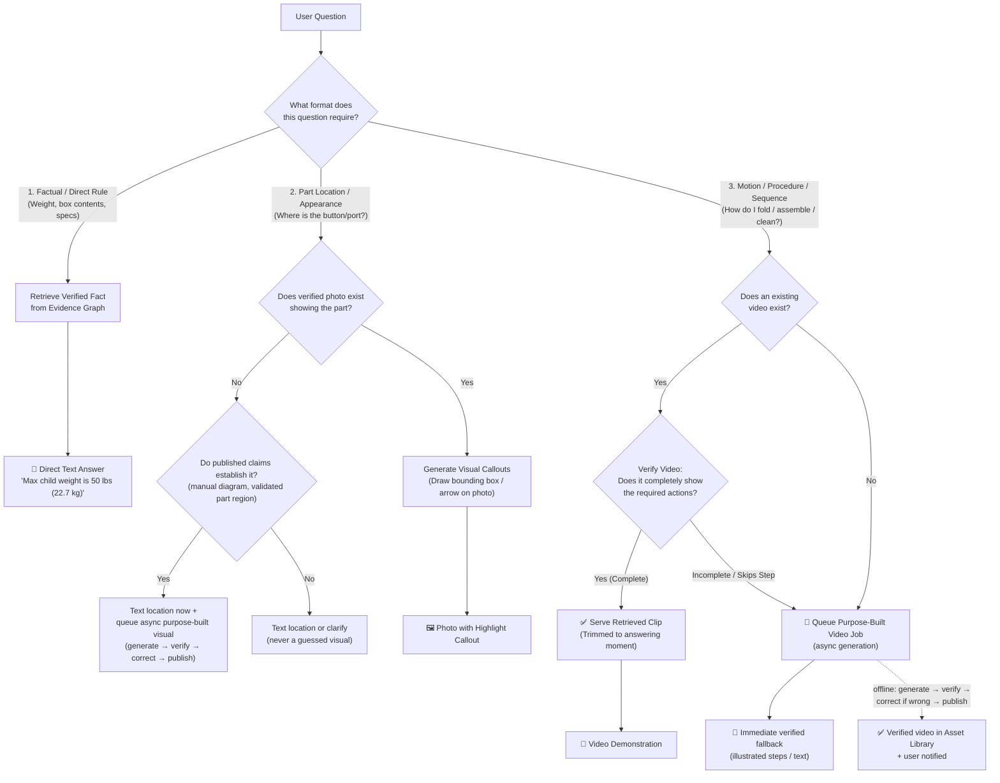
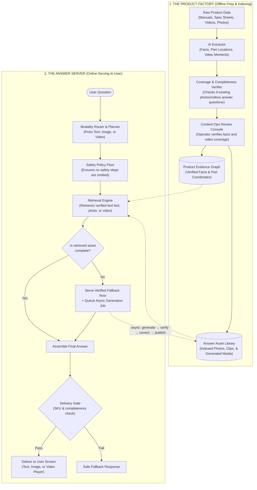

# ShowMe: System Architecture Guide

**Version:** 3.6  
**Date:** 2026-08-19  
**Status:** Approved Architecture Blueprint  
**Role:** Non-normative orientation guide. Exact contracts and behavior are defined in [low-level-design.md](./low-level-design.md); where the two differ, the LLD governs.  

---

## 1. The Big Idea: What is ShowMe?

ShowMe is a smart product-understanding assistant that **answers user questions using the simplest, most effective format: Text, Image, or Video**.

We follow two fundamental design principles:

1. **The Format Hierarchy (Least Complex Format First):**
   * 📝 **Text First:** If a question is basic and direct (weights, rules, warranty, specs), we answer in concise text.
   * 🖼️ **Image Next:** If a question requires locating a part or checking visual appearance, we show an image with clear callouts.
   * 🎥 **Video When Needed:** If an answer requires seeing motion, direction, or step-by-step physical action, we show a video demonstration.

2. **The Retrieval-First, Then-Generation Rule:**
   * For **every modality** (Text, Image, or Video), we **retrieve existing approved content first**.
   * We **verify** if the retrieved content completely answers the user's question.
   * If existing content is missing or incomplete, we **generate** the answer **asynchronously** (image callouts, step animations, or purpose-built videos): the user gets a verified fallback immediately, the generated asset is verified — and corrected if wrong — offline, then saved to the Answer Asset Library and announced. Nothing generated is served before it passes verification.

```
                      THE CORE SHOWME PHILOSOPHY
  ┌───────────────────────────────────────────────────────────────────┐
  │  1. Pick the simplest format:  Text ──► Image ──► Video          │
  │  2. For that format:       Retrieve First ──► Verify Completeness │
  │                                           ──► Generate if Missing │
  └───────────────────────────────────────────────────────────────────┘
```

---

## 2. Complete Routing & Serving Flowchart



---

## 3. Rich Use Cases Across All 3 Formats

### 📝 Format 1: Text Answers (Simple, Direct, Instant)
When words and numbers are faster and clearer than watching media:
* **Product Specifications & Limits:**
  * *"How much does this stroller weigh?"* &rarr; **13.8 lbs (6.2 kg) travel weight**.
  * *"What is the maximum child weight?"* &rarr; **50 lbs (22.7 kg)**.
  * *"What are the folded dimensions?"* &rarr; **32.5 × 52 × 65 cm**.
* **Rules, Policies & Care Guidelines:**
  * *"Is the seat fabric machine-washable?"* &rarr; **Yes, gentle cycle cold; air dry only**.
  * *"What comes in the box?"* &rarr; **Frame, 4 wheels, bumper bar, canopy, storage basket**.
  * *"How long is the warranty?"* &rarr; **1-year limited manufacturer warranty**.
* **Compatibility Facts:**
  * *"Does this laptop have a headphone jack?"* &rarr; **Yes, standard 3.5mm combo jack on the left side**.
  * *"Which car seat models fit without an adapter?"* &rarr; **Graco SnugRide series only**.

---

### 🖼️ Format 2: Image & Photo Callouts (Location & Visual Appearance)
When the user needs to spot a physical part or compare visual looks:
* **Locating Hidden Controls & Ports:**
  * *"Where is the serial number barcode on this stroller?"* &rarr; *Retrieves verified underside photo + draws red highlight box around rear axle label.*
  * *"Where is the headphone jack on this laptop?"* &rarr; *Highlights exact 3.5mm port on left edge photo.*
  * *"Where is the filter reset button on my air purifier?"* &rarr; *Highlights top panel control icon.*
* **Visual Appearance & State Verification:**
  * *"What does the stroller look like when folded with wheels on?"* &rarr; *Retrieves official folded photo.*
  * *"What is the difference between the Mineral Green and Black colorways?"* &rarr; *Retrieves side-by-side product photos.*
  * *"Where is the foot brake indicator?"* &rarr; *Highlights green/red brake pedal state.*

---

### 🎥 Format 3: Video Demonstrations (Motion, Action & Procedures)
When text and photos are not enough because the user must see direction, motion, or sequence:
* **Folding & Unfolding Mechanisms:**
  * *"Show me how to fold this stroller with one hand."*
  * *Pipeline:* Check existing promo video &rarr; If promo skips the thumb switch, generate a purpose-built demonstration clip showing: thumb slide $\to$ handle squeeze $\to$ frame collapse $\to$ auto-lock click.
  * *"How do I open it back up?"* &rarr; Shows storage latch release and upward frame flick.
* **Assembly & Accessory Attachments:**
  * *"How do I attach the infant car seat adapter?"* &rarr; Shows rail alignment and locking click.
  * *"How do I install the bumper bar and cup holder?"* &rarr; Shows snap-in sockets.
  * *"How do I install the rain canopy?"* &rarr; Shows clip-on frame anchors.
* **Everyday Operation & Adjustments:**
  * *"How do I recline the seat back for a nap?"* &rarr; Shows pulling the rear recline strap clamp.
  * *"Show me how to adjust the 5-point safety harness straps."* &rarr; Shows threading shoulder height slots.
  * *"How do I extend the telescoping handlebar?"*
* **Disassembly, Cleaning & Care:**
  * *"How do I remove the seat fabric for machine washing?"* &rarr; Demonstrates releasing snaps, elastic loops, and harness anchors in order.
  * *"How do I pop off the rear wheels to fit in a travel bag?"* &rarr; Shows pressing quick-release axle pin.
  * *"How do I remove the coffee machine brew group to rinse it?"*
* **Troubleshooting & Jams:**
  * *"The fold latch feels stuck—what should I press to release it?"*
  * *"Why won't the canopy stay open?"* &rarr; Shows engaging side tension locks.
  * *"How do I unlock front swivel wheels when stuck on gravel?"*

---

## 4. System Overview: The Two Halves



---

## 5. The 3 Asset Lanes

| Lane | Modality | When to Use | Production Method |
|---|---|---|---|
| **Lane 1: Text & Facts** | 📝 Text | Specs, weights, dimensions, warranty, rules. | Retrieved directly from verified Evidence Graph claims. |
| **Lane 2: Photo Callouts** | 🖼️ Image | Locating parts, buttons, ports, serial numbers. | Retrieved verified photo + automated 2D bounding-box callout. |
| **Lane 3: Video Demonstration** | 🎥 Video | Motion, mechanisms, folding, assembly, cleaning. | **1. Retrieve:** Verified existing video segment.<br>**2. Generate (async):** Purpose-built video prepared offline, verified and corrected before publication; the user gets illustrated steps immediately and a notification when the verified video is ready. Every depicted motion must be grounded in approved evidence — ungrounded "plausible" motion is never served as instruction. |

These three user-facing lanes map to the LLD's internal factory lanes (LLD §7.4): Lane 1 is served directly from published claims; Lane 2 is produced by factory Lanes A (exact static visual) and B (purpose-built visual), with animated step cards produced by Lane C; Lane 3 is produced by factory Lanes D (procedural video) and E (labeled non-instructional transition).

---

## 6. Assisted Operator Review Console

The operator review tool verifies existing video coverage and extracted text/photo facts side-by-side with the official user manual:

```
  ┌────────────────────────────────────────────────────────────────────────┐
  │                 OPERATOR VERIFICATION WORKBENCH                        │
  ├────────────────────────────┬───────────────────────────────────────────┤
  │ [Retrieved Content Audit]  │ [Manual Ground Truth]                     │
  │ Modality: Video / Folding  │  ┌──────────────────────────────────────┐ │
  │ Existing Clip: 'promo.mp4' │  │ Page 8, Figure 3: Folding Mechanism │ │
  │ Segment: 00:14 - 00:18     │  │ [=== HIGHLIGHTED DIAGRAM ===]        │ │
  │ Check: Shows thumb switch? │  │ "User MUST slide thumb switch (A) and│ │
  │ Result: ❌ Skipped in video│  │ squeeze handle lever (B) together."  │ │
  │                            │  └──────────────────────────────────────┘ │
  ├────────────────────────────┴───────────────────────────────────────────┤
  │ Action: [ 🎥 GENERATE PURPOSE-BUILT CLIP ]   [ ✅ APPROVE RETRIEVED ]  │
  └────────────────────────────────────────────────────────────────────────┘
```

---

## 7. Safety Traffic Lights (Consequence Tiers)

```
  ┌──────┬──────────────────┬─────────────────────────────┬───────────────────────────────┐
  │ Tier │ Consequence      │ Examples                    │ Verification Standard         │
  ├──────┼──────────────────┼─────────────────────────────┼───────────────────────────────┤
  │  C0  │ Informational    │ Product color, weight, box  │ Automated check               │
  │      │ (Cosmetic)       │ contents                    │                               │
  ├──────┼──────────────────┼─────────────────────────────┼───────────────────────────────┤
  │  C1  │ Reversible Task  │ Everyday folding, reclining │ Automated check + sample audit│
  │      │ (Minor delay)    │ canopy, cup holder install  │                               │
  ├──────┼──────────────────┼─────────────────────────────┼───────────────────────────────┤
  │  C2  │ Purchase & Care  │ Fabric washing, wheel removal│ Mandatory Human Sign-off     │
  │      │ (Possible damage)│ third-party compatibility   │                               │
  ├──────┼──────────────────┼─────────────────────────────┼───────────────────────────────┤
  │  C3  │ Safety Critical  │ Car seat installation,      │ Mandatory Human Sign-off +    │
  │      │ (Injury risk)    │ harness strap threading     │ Non-removable Safety Warnings │
  └──────┴──────────────────┴─────────────────────────────┴───────────────────────────────┘
```

> **P0 note:** any instructional media — including C1 procedures — requires human sign-off before publication (LLD §7.5). "Sample audit" applies only to non-instructional C1 content.

---

## 8. 5-Phase Implementation Roadmap (Milestone Driven)

### 🔹 Phase 0: The Rulebook & Blueprints
* **What we build:** Ground rules for how the system selects formats and verifies safety before writing complex code.
* **Deliverables:**
  * The rules for choosing **Text**, **Picture**, or **Video** based on user intent.
  * The **Safety Checklist** that every answer must pass before the user sees it.
* **Working Demo:** A test script proving the system accurately categorizes 50 sample questions into Text, Image, or Video.

---

### 🔹 Phase 1: Read Manuals & Answer Text Facts
* **What we build:** Ingest 1 test product (like a Graco stroller) and answer basic factual questions with citations.
* **Deliverables:**
  * Store the official user manual, spec sheets, and warranty rules in a structured database.
  * An easy screen for human reviewers to approve facts against highlighted manual sentences.
* **Working Demo:** Ask *"How much does this stroller weigh?"* or *"Is the fabric washable?"* &rarr; Get an instant, 100% cited text answer.

---

### 🔹 Phase 2: Highlighted Photos & Animated Diagrams
* **What we build:** The ability to answer *"Where is..."* and *"How do I assemble..."* questions visually.
* **Deliverables:**
  * **Photo Callouts:** Automatically draw boxes/arrows on real product photos to pinpoint parts.
  * **Animated Step Cards:** Turn black-and-white drawings from manuals into animated step-by-step cards.
* **Working Demo:**
  * Ask *"Where is the serial number?"* &rarr; Shows real photo with red circle on the rear axle.
  * Ask *"How do I attach the cup holder?"* &rarr; Shows an animated 3-step card sequence.

---

### 🔹 Phase 3: Purpose-Built Video Demonstrations
* **What we build:** The full video engine for mechanisms and moving parts.
* **Deliverables:**
  * **Retrieve & Verify:** Search official video clips and verify if they completely show the required actions.
  * **Generate:** If video is missing or skips steps, generate a purpose-built demonstration video asynchronously; it is verified (and corrected if wrong) before it is published and served.
* **Working Demo:** Ask *"Show me how to fold this stroller with one hand"* &rarr; Plays an exact 5-second video clip showing the thumb-switch slide, handle squeeze, and frame collapse.

---

### 🔹 Phase 4: Scale to 10+ Products
* **What we build:** Expand from 1 pilot product to a full catalog across baby gear and electronics.
* **Deliverables:**
  * Onboard strollers, infant car seats, laptops, and appliances.
  * Streamline operator review tools so a new product can be onboarded rapidly.
* **Working Demo:** A multi-product assistant answering questions across 10+ products using Text, Photos, and Videos.
