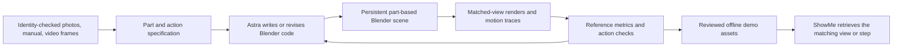

# Astra + Blender: Ready2Jet folding POC

Prepared September 18, 2026. **Proposed experiment; not executed.**

Recommendation: test Astra authoring a part-based Ready2Jet model directly in Blender, using the existing source evidence and an explicit render–compare–revise loop. Remove Tripo from the candidate asset-building path. Compare against the existing POC 6 Blender model, not just the static Tripo mesh. The question is whether Astra can close the shape and motion gaps at an acceptable authoring cost.

## Project understanding

ShowMe answers questions about physical products with cited text, images, and video, with follow-ups intended to update the same visual explanation. Its distinctive requirement is exact-product, evidence-backed behavior. A convincing generic stroller animation does not satisfy that requirement.

The implemented foundation is local: manufacturer sources in `source-vault/`, structured claims and separate review/verifier records in `evidence-packs/`, extraction and answer logic in `system/`, and a Python HTTP server plus JavaScript interface in `app/`. The catalog covers Ready2Jet, SnugRide, MacBook Air M3, Bose QC Ultra, and Levoit Core 300S. There are 468 stored claims across those five packs. Cloud services and a general product/state reasoning system are architectural ambitions, not the current backing store.

The current experimental video path lives in `app/keyframe_video.py`, `app/keyframe_synthesis.py`, and `app/video_jobs.py`. It uses registered keyframes, Seedance interpolation, sampled-frame VLM checks, and pending asset registration. `system/video_pipeline.py` is empty and `system/draft_state_graph.py` is a placeholder. A Blender POC belongs in the offline asset factory, followed by retrieval of prepared videos in the app.

### What the experiments establish

| Existing work | Recorded result | Implication for this POC |
|---|---|---|
| Controlled Higgsfield fold | 0/3 successful folds | Prompted video has not met this task's requirements. |
| Seedance keyframe chain | Better endpoints and direction; floating, changing viewpoint, omitted controls, uncertain mechanism | Evaluate the whole transition and required actions, not endpoints alone. |
| Tripo H3.1 reconstruction | 97.2% of faces in one welded component | Useful appearance reference, poor starting topology for independent moving parts. |
| POC 6 handle spike | Parametric rebuild won; mesh surgery left fragmented/non-manifold geometry | Direct Blender construction already has local evidence in its favor. |
| POC 6 articulated model | Open dimensions within 2.6%; folded depth +63.3% versus an inferred reference | Controllability exists; product fidelity remains unresolved. |
| Tripo shell bound to the rig | Motion matched the authored rig; worst edge stretch 192.556× | Matching a rig does not make a fused shell articulatable or the rig physically correct. |
| VACE over rendered motion | All four main runs failed identity; strongest silhouette mean 0.9322 against the control | A good match to an imperfect control is not a match to the real product. |
| Scan texture projection | Key-part coverage 17.89% versus a 60% gate | Appearance cannot repair misaligned geometry. |
| Official-photo projection | Ready2Jet best eligible camera match 0.65756 versus 0.75 gate | Improve shape before spending time on textures. |
| POC 8 connection scene | MacBook failed identity/port geometry after rescanning | Model task-critical features explicitly; overall resemblance is insufficient. |
| Existing Astra scene | 225 mesh objects stayed consistent across four camera/lighting renders | Confirms a local persistent-scene workflow, not exact-product reconstruction or mechanism accuracy. |

These are historical results from saved artifacts, not reruns performed for this plan. The older reports sometimes describe motion as “verified” or “mechanically correct”; the code and later review justify the narrower description **authored articulated prototype with known discrepancies**.

### Evidence problems that affect the experiment

1. **SKU mismatch:** the vault directory/identity says 2212125, while `poc-3d-static-twin/inputs/source-manifest.json` identifies the gray/tan Kingston reference images as **2209064**. Use Kingston as the proposed visual target; resolve or explicitly bound cross-SKU manual applicability before calling the result exact-SKU validated.
2. **No independent global held-out view:** the former title-card held-out image duplicates the anchor studio asset. Do not revive it as independent validation. Existing views have already informed past modeling.
3. **Mixed states and derived images:** the input set mixes extended, scrunched, and collapsed canopy states. The side image is a person-removal derivative; another image has unresolved colorway/liner identity. Group by state and confidence, rather than treating all images as simultaneous observations of one rigid model.
4. **Missing physical evidence:** rear geometry, exact control travel, seat/canopy linkage, and internal locks are not established. Folded dimensions are inferred. The recorded owner decision rules out buying a stroller; this plan uses the existing vault first.
5. **Wrong-mechanism material exists:** `graco_stroller_folding/graco_folding_frames.md` describes a FastAction seat-strap fold. Exclude it from Ready2Jet mechanism evidence.
6. **Current serving checks are narrower than physical correctness:** procedure composition filters claims before judging the aggregate; the video verdict parser accepts a top-level pass without enforcing every checklist answer. The POC evaluator must not inherit those gaps.

## What Astra changes

Astra reads approved references, proposes structured part/joint parameters, writes Blender Python, examines renders and measurements, and revises the scene. Blender stores and evaluates the explicit geometry and animation. Rendered frames come from that saved scene.

OpenAI's [Astra architectural visualization example](https://developers.openai.com/blog/architectural-visualization-with-astra) demonstrates editable scene construction through `bpy`, background rendering, and iterative inspection. That supports this workflow hypothesis; it does not establish recovery of a real stroller's hidden mechanism. The [Astra model documentation](https://developers.openai.com/api/docs/models/gpt-6-astra) lists image input and coding/tool capabilities. Use timestamped video frames as image evidence; this plan does not assume native video understanding or a direct mesh-output API.



The expected advantages are separate rigid parts, stable identity across frames, explicit controls, editable cameras, and reusable actions. The remaining uncertainty is whether the available observations constrain a sufficiently accurate model. Deterministic wrong motion is still wrong.

## Scope and comparison

One product, one fold action, three views: a source-matched full view, a control close-up, and a novel rear-right diagnostic view. Build an empty stroller. Produce a short mechanical demonstration first, followed by an instructional storyboard only if its required content is covered.

| Arm | Purpose |
|---|---|
| A: frozen POC 6 procedural twin | Main motion/shape baseline. Reuse saved results; remeasure under the new protocol where necessary. |
| B: existing Tripo scan and skinned fold | Historical appearance/topology baseline. No new provider generation needed. |
| C: Astra-authored procedural Blender candidate | Build from evidence with clean part boundaries and revised geometry/motion. No Tripo mesh or texture input. |
| D: official source demonstration | Observable reference and retrieval alternative, not a competing reconstruction. |

This is an incremental engineering experiment. Astra has access to prior code and findings, so a successful result would not establish a controlled model-level win over an earlier language model. Likewise, old Meshy and Tripo runs did not have identical inputs and do not form a fair provider benchmark.

Reuse geometric helper functions, file conventions, reference extraction, and reporting ideas. Re-estimate product-specific dimensions and pivots from stated evidence. Starting from the old `.blend` would carry its hidden Tripo scaffold; start a fresh scene and audit imports/dependencies instead. Preserve the old artifacts for comparison.

## Execution stages

### Stage 0 — Evidence and scoring contract (2–3 active hours)

- Create an isolated `poc-astra-ready2jet/` workspace. Record source hashes, original state, SKU confidence, derivations, and allowed uses.
- Make a source table resolving the conflicts above. Keep unresolved sources out of binding metrics. Study person-containing manufacturer frames as evidence; do not transfer historical person-removal artifacts into ground truth without their derivation labels.
- Read the fold sequence against manual pages 33–35 and current claim IDs. Separate documented operations, observed motion, and inferred hidden details.
- Annotate visible wheel centers, side hubs, handle pivot/grip, belly bar, seat boundaries, and silhouette masks at open, early, middle, late, and folded stages. Record occlusions rather than inventing landmark locations.
- Fit one camera per source shot, accounting for the control-close-up/wide-shot cut. Freeze the camera for each continuous shot. Split available observations into fitting and diagnostic sets before candidate iteration; label same-video withheld frames as interpolation diagnostics, not independent real-world validation.
- Freeze thresholds and the run budget. Record baseline scores under this same protocol.

**Exit:** a usable reference-fit contract with visible limitations. Missing novel-view evidence limits the conclusion; it need not block an internal modeling experiment. Contradictory evidence for a critical mechanism feature pauses that feature instead of being resolved by guessing.

### Stage 1 — Shape and compactness spike (4–6 active hours)

Build the frame, split handle, pivots, four wheel assemblies, seat, canopy, basket, belly bar, cup holder, thumb switch, and underside lever as separate named parts. Define units and axes once. Keep the initial material treatment simple so shading cannot hide geometric mistakes.

Use one topology for open and folded states. Start with the handle/frame assembly and a complete coarse envelope; test open, middle, and folded poses before detailing fabric. Focus on the old model's oversized folded depth, seat position, upper-handle placement, and incorrect silhouette.

Fit the geometry to multiple consistent source states. Do not shrink rigid members, swap in a second folded mesh, move the camera independently at each time, or hide parts to hit a target silhouette. Any changed pivot must have a source rationale or an explicit inferred range.

**Exit:** the candidate clears the static-shape gate below and materially improves folded compactness. If it still resembles the old blockout after the bounded iterations, stop before materials or high-resolution rendering and report the limiting observation.

### Stage 2 — Fold motion and action coverage (4–6 active hours)

Represent the motion as a parameterized kinematic chain with named stages, joint limits, and an event timeline. Use visible reference trajectories to fit parameters; treat the existing hard-coded rotations and 75 mm whole-object lift as baseline hypotheses, not ground truth.

The action contract must account for:

| Requirement | POC depiction |
|---|---|
| Remove infant car seat if present | Explicit precondition: the modeled stroller starts empty. A full removal demonstration is out of this POC. |
| Unlock brakes | Source-backed preparatory panel or evidenced control animation; never silently omit. |
| Fold canopy | Visible preparation state before frame collapse. |
| Rotate cup holder / orient front wheels | Optional compact-fold tips, separately labeled. |
| Slide thumb switch | Close-up of the actual control location and supported direction. |
| Squeeze underside lever | Close-up before fold onset; verify travel in world space against the manual, not just the sign of a local driver. |
| Frame collapse | Matched temporal poses and continuous rigid-part motion. |
| Check secure | Present the manual's check. A scripted latch variable is not proof of a real latch engaging. |
| Carry by belly bar | Source-backed final panel; do not equate “bar exists” with a demonstrated carrying action. |

Use constrained fabric deformation or shape keys for seat/canopy/basket; label the unobserved behavior inferred. Keep rigid frame and wheel parts rigid. If an operator-supported interval is necessary, disclose it; do not show unexplained levitation or force continuous wheel contact where the source shows support.

**Exit:** visible motion and sequence pass; residual hidden-mechanism uncertainty remains explicit. A person-free animation remains a motion illustration, not proof of one-handed ergonomics, release force, physical self-folding dynamics, or a complete instruction video.

### Stage 3 — Appearance and reusable views (3–5 active hours)

Add evidence-matched gray fabric, black frame, tan handle grip, black belly bar, and tri-spoke wheel appearance. Use restrained procedural materials first. Avoid invented controls and pseudo-brand text. Optional official-photo projection runs only after the specific source/state camera match clears its gate; document covered and neutral surfaces.

Render from the same scene/action:

1. A 6–10 second full fold, with any slowed playback labeled.
2. A synchronized control close-up.
3. A rear-right diagnostic view, with inferred surfaces disclosed.
4. An open-state turntable and open/mid/folded comparison sheet.

For “show it from behind,” change only the camera. For “slow down the release,” change timing without changing the path or stage order. Recheck geometry/action fingerprints. Novel-view consistency is testable even when novel-view accuracy is not.

### Stage 4 — Evaluation and ShowMe preview (2–4 active hours)

Run the frozen evaluation, produce a comparison report, and retain failed attempts. Test negative controls: reverse fold direction, skip lever release, remove a required wheel, introduce an incorrect control, and omit the secure-check panel. The relevant checks must reject each deliberate defect. An invisible internal latch failure should return unknown from a pixel-only judge; it must not be claimed visually detectable.

Then prepare a sandboxed ShowMe preview using a copied registry and unique candidate asset IDs. Serve the pre-rendered variants for “show the fold,” “show the release control,” and “show it from behind.” A small allowlisted mapping is sufficient for this demo; it is not an existing general follow-up capability. Keep preparation text/source panels beside the mechanical clip. Do not bind a clip to a claim it does not depict or substantiate.

Avoid `VideoJobManager._register()` unchanged for multiple variants: its current IDs collapse to one asset per procedure and upsert the record. The POC needs unique version/view IDs and full provenance. If a renderer adapter is later needed, the extension point is `_resolve_generator()` plus a typed asset manifest, not replacing the online Luna planner with Astra.

## Proposed acceptance gates

Freeze these before building. They are POC targets, not measured results or manufacturing tolerances.

| Dimension | Proposed gate | Interpretation |
|---|---|---|
| Input identity | Every binding reference has compatible SKU/state or a documented applicability decision | Unresolved cross-SKU material cannot prove exact-SKU fidelity. |
| Open dimensions | No axis exceeds 3% error against the rechecked recorded specification | Recheck the source first; the claim vault currently lacks a complete spec transcription. |
| Static reference shape | Silhouette IoU ≥0.85 on each selected unoccluded, state-matched global fitting view; visible-landmark max error ≤3% of image diagonal | Reference-fit result, not held-out generalization. No per-frame camera cheating. |
| Folded envelope | Depth, width, and height each within 10% of the existing inferred target; substantial improvement over +63.3% depth | Diagnostic only. Does not establish real trunk fit or official folded dimensions. |
| Motion reference fit | Five frozen comparison poses each achieve ≥0.85 visible silhouette IoU and ≤3% landmark error where scorable; correct event order and motion direction throughout | Keep occlusion masks and exclusions fixed. Report unscorable events explicitly. |
| Rigid-part integrity | Fixed part inventory; rigid lengths change <0.1%; no topology swaps/disappearing parts | Evaluate all rendered frames, not eight samples. |
| Collision/contact | No unexplained hard-part or floor penetration >2 mm at rendered frames; inspect high-motion intervals at subframes and review contacts | Approximate geometry check, not a physical dynamics or stability certificate. List intended-contact exemptions. |
| Soft goods | No visible tearing or triangles bridging unrelated moving parts; log deformation metrics separately | Rigid-frame tolerances do not apply to fabric. |
| Identity | Required visible parts, wheel design, control placement, and colors agree with the applicable references; no invented functional features | Blinded side-by-side review supplements metrics. |
| Procedure coverage | Every required item has a shown segment, source panel, or explicit scope/precondition disposition | A motion-only clip cannot receive a “complete instructions” pass. |
| View/edit consistency | Camera-only variants preserve geometry and motion; retiming preserves the action path/order | Scene/data fingerprints should match; stochastic rendered pixels need not. |
| Evaluator quality | Each visible negative control fails its targeted gate; missing evidence returns unknown | A top-level VLM pass cannot override failed or missing required checks. |
| Reproducibility | Fresh scripted build reproduces scene structure and metrics within declared tolerances | Log Blender version, scripts, parameters, hashes, and render settings. |

Use a separate reviewer for final visual scoring where possible. Astra can critique its own iterations, but self-review is not independent validation. Qwen may be an advisory second opinion if separately budgeted; current small-sample verifier results do not establish calibrated physical correctness.

## Effort, runtime, and stopping rules

Estimated active work: **15–24 hours**, usually about **3–5 working days including review and render waits**. This is a planning estimate. Track human review time, agent/model execution time, rendering time, revisions, and provider spend separately. The old 3.8-hour result was agent wall-clock and is not a measured human-labor baseline.

Use the existing local runtime where compatible. The Astra scene records Blender/bpy **5.0.1**; older twin artifacts/scripts record **5.2.0 LTS** and a different machine path. Confirm the actual runtime and test the action/driver/render APIs before assuming old `.blend` files load identically. The candidate starts from scripts in a fresh scene. Use low-resolution previews, then benchmark a few final-resolution frames before scheduling all three videos.

Allow at most three recorded candidate revisions for the shape gate and three for motion within the total time box. Stop after persistent critical identity, compactness, or trajectory failure. Do not proceed to an appearance pass merely because an attractive still is possible.

The default requires **no new Tripo, video-generation, or render-farm purchases**. Local rendering still consumes compute and Astra usage is not free. Record actual usage; do not inherit historical provider prices or budgets. This plan does not launch paid jobs.

If the source evidence cannot distinguish two materially different fold mechanisms, report that uncertainty and the specific extra view needed. Do not purchase/capture a physical stroller as an assumed dependency. A new authorized source set would support a later independent validation round.

## Deliverables and decision

Proposed implementation files, not yet created:

```text
poc-astra-ready2jet/
  README.md
  input-manifest.json        # SKU, state, source hashes, exclusions
  reference-annotations.json
  part-spec.json
  joint-evidence.json
  action-spec.json
  build_geometry.py
  rig_fold.py
  render_views.py
  evaluate.py
  runs/<revision>/           # parameters, logs, metrics, failed attempts
  output/ready2jet.blend
  output/fold-main.mp4
  output/fold-controls.mp4
  output/fold-rear-right.mp4
  output/comparison-sheet.png
  evaluation.json
  effort-and-usage.json
  report.md
```

**Proceed with Astra + Blender for this product** if the candidate clears the observable shape/motion gates, improves on the old twin, preserves identity, and fits the effort budget. This supports the direct procedural route for Ready2Jet; broader catalog economics need another product and repeated builds.

**Partial success** means useful explanatory geometry with unresolved exact-product or hidden-mechanism accuracy. Keep it explicitly illustrative and use manufacturer evidence for the unsupported instruction portions.

**Stop** if the candidate still misses compactness, changes rigid dimensions to fake the fold, requires unsupported hidden joints, or spends the time box polishing an inaccurate shape. Report the missing observations instead of switching back to another unconstrained video generator.

A Tripo-free candidate removes that mesh's dependency only if the recorded ancestry actually excludes it. Manufacturer imagery/source-use restrictions and publication review remain separate. Keep the research deliverables internal and unapproved, consistent with existing source records; a POC pass is not a publication decision.

## Review scope and key local evidence

The repository inventory contained **1,658 files** excluding `.git`, `__pycache__`, and `.DS_Store`: 106 Markdown documents, 103 Python files, 287 JSON files, plus UI/configuration files and many rendered images, video frames, PDFs, videos, and binary 3D assets. The review surveyed document structure across all Markdown files, parsed all JSON records and Python syntax/function inventories, and examined the relevant architecture, implementation, experiment reports, source manifests, fold claims, and rig/validation code in depth. Representative fold comparison sheets, the three manual fold-page rasters, and an Astra scene render were visually inspected.

This is not a claim that every document was read line by line, every video was watched end to end, or every binary scene was opened. Saved metrics were cross-checked with their reports and key code; they were not recomputed in Blender for this planning task. Unrelated resume material was not used.

- [High-level product design](../architecture/high-level-design.md) and [LLD](../architecture/low-level-design.md).
- [September implementation review](../planning/showme-code-review-2026-09-11.md).
- [Tripo probe scorecard](../../poc-3d-static-twin/evaluation/scorecard-tripo-h31-probe-01.md) and [input manifest](../../poc-3d-static-twin/inputs/source-manifest.json).
- [POC 6 report](../../poc-3d-static-twin/twin/report.md), [geometry decision](../../poc-3d-static-twin/twin/stage-b-decision.md), and [dimension measurements](../../poc-3d-static-twin/twin/verification/dimension-check.json).
- [Geometry builder](../../poc-3d-static-twin/twin/build_twin_geometry.py), [rig script](../../poc-3d-static-twin/twin/rig_twin.py), and [Stage C validator](../../poc-3d-static-twin/twin/validate_stage_c.py).
- [Kinematic evidence study](../../poc-3d-static-twin/evaluation/fold-kinematics.md), [current fold claims](../../evidence-packs/graco-ready2jet-2212125/claims.json), and [source manifest](../../source-vault/graco-ready2jet-2212125/manifest.json).
- [Skinning failures](../../poc-3d-static-twin/twin/stage-s-report.md), [VACE findings](poc7-vace-skin-findings.md), and [photo-projection report](../workorders/report-photo-projection.md).
- [Seedance chain findings](seedance-keyframe-chain-poc-findings.md) and [current registered generated fold](../../evidence-packs/graco-ready2jet-2212125/derived-assets.json).
- [Astra scene experiment](../../poc-astra-scene/README.md) and [saved validation](../../poc-astra-scene/output/validation.json).

The first implementation milestone should be an **open/mid/folded clay-render comparison sheet with measured errors**. It gives a quick, concrete answer to whether this route is closing the project's actual gap.
