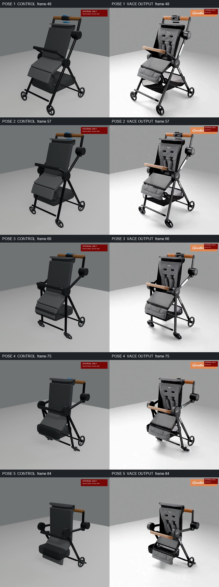
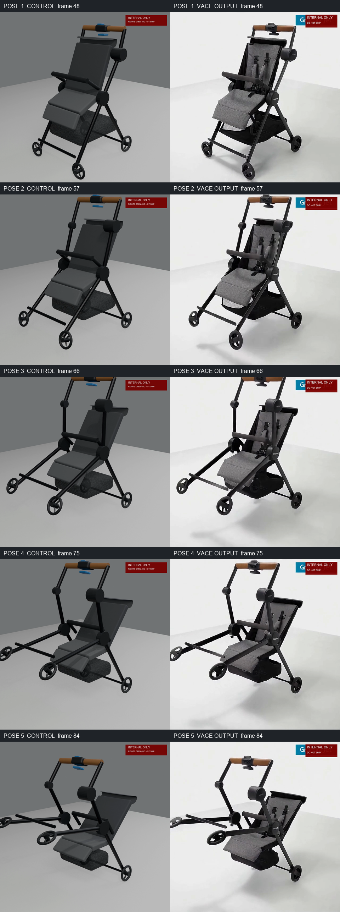

# POC 7 — VACE realism skin over the twin fold

**Date:** 2026-08-27

**Status:** COMPLETE FOR INTERNAL RESEARCH — **INTERNAL ONLY — DO NOT SHIP**

**Trust label if a future run passes:** `TWIN_RENDER_VACE_SKIN`
**Rights:** Tripo3D license check and generated-asset review remain open. `approved_by` is untouched.

## Verdict

**POC 7 does not yet deliver a serving-safe photoreal fold.** WAN VACE can make the schematic twin look substantially more like the Kingston stroller, and 720p can preserve the control silhouette and five fold stages. However, every run failed the binding identity gate by inventing or altering visible parts. Common defects were an added handle-top control, a tan belly bar where the exact product has a black belly bar, and hallucinated pseudo-brand text.

The strongest motion result was run 2 at 720p: silhouette IoU was `0.9322` mean / `0.8910` minimum and all five same-timestamp fold poses matched. It is still **not serving-safe** because identity failed. No output was registered in `derived-assets.json`.

Provider cost for one four-second, 96-frame video was **$0.24 at 480p** or **$0.48 at 720p** under the live account pricing. Total POC spend, including the negative control and four Qwen advisory requests, was **$1.72**, below the $15 hard ceiling.

## Governing controls

- The only motion input to each VACE run was its watermarked deterministic control clip. Prompts described appearance only; none described a movement, mechanism, or step order.
- Inputs were person-free: scripted twin renders plus the official product-only Kingston image `view-01-front-3q.png`.
- Every locally retained MP4 and GIF is visibly watermarked `INTERNAL ONLY` / `DO NOT SHIP`. The provider output was downloaded only to a temporary directory and was not retained without the watermark.
- Every submission has `submission.json` with SHA-256 inputs, an immediately persisted `request.json`, `result.json`, watermarked video/GIF, 96 extracted frames, a five-pose contact sheet, and verification records.
- The live endpoint schema was verified before the first submission at [fal's Wan VACE depth API](https://fal.ai/models/fal-ai/wan-vace-14b/depth/api). It accepted `video_url`, `ref_image_urls`, preprocessing, input frame/FPS matching, fixed seed, and 480p/720p. The live structure/pose alternative `fal-ai/wan-vace-14b/pose` was recorded but not run.

Provenance anchors:

- Twin blend SHA-256: `83d80dc107d46edecbe89d4d97dabf726887012dd4c0917f8da8e2961a9dc79d`
- Kingston reference SHA-256: `2480f81d2987d6c4b7026c6fd024772066b5307d4568d3740ca435c2dafed8c9`
- Official-angle control SHA-256: `a71b449619503cabf25d3c5c615d543028851cd14aa037d3eb43bd192853c98f`
- Novel rear-right control SHA-256: `cb61506fa4485439df6c0e012129451091160a1e1ffa237b845879a6ea0d931a`
- Defect control SHA-256: `1b0093087a95511aacb72e1634e6e84177379eebc7715ddda0a1821069b0a29f`

## Ordered run matrix

| Run | Control | Resolution / seed | Request ID | Cost | Silhouette mean / min | Five poses | Identity | Serving verdict |
|---|---|---|---|---:|---|---|---|---|
| 1 | official angle | 480p / 42001 | `01a043d8-4732-7992-89fa-d4e42e94e1fc` | $0.24 | `0.7796` / `0.7325` — FAIL mean | PASS | FAIL — invented silver handle controls | **FAIL** |
| 2 | official angle | 720p / 42001 | `01a043e0-204e-72b3-a554-65e216775bb5` | $0.48 | `0.9322` / `0.8910` — PASS | PASS | FAIL — tan belly bar, handle device, pseudo-brand text | **FAIL** |
| 3 | novel rear-right | 480p / 42001 | `01a043e6-2b2c-7711-9385-e44d4fa1629f` | $0.24 | `0.7729` / `0.7307` — FAIL mean | PASS | FAIL — invented handle badge/control, pseudo-brand text | **FAIL** |
| 4 reserve | official angle; best 720p configuration with appearance-only identity clarification | 720p / 42002 | `01a043e8-b842-7792-9a05-4f8987bbfdc8` | $0.48 | `0.8160` / `0.7625` — PASS | PASS | FAIL — tan belly bar and handle device persist, pseudo-brand text | **FAIL** |

The early-stop rule did not trigger because run 1 failed the silhouette mean and identity gates. Runs 2–4 were therefore executed in order; no additional main-matrix slot was used.

## Best run before/after

Run 2 is the best motion-preservation result. The deterministic control is on the left and VACE at the same timestamp is on the right:

- Watermarked MP4: [run 2 video](../../poc-wanvace-control-video/out/twin-skin-2/video.mp4)
- Watermarked GIF: [run 2 GIF](../../poc-wanvace-control-video/out/twin-skin-2/video.gif)
- Output SHA-256: `97b1245c357c6a59f8e15bb1d3e79c180614ac616b7255fa94fa8cf4c4a5cec7`

The contact sheet shows why silhouette/pose can pass while identity fails: the overall geometry follows the twin, but the appearance model repaints the belly bar tan and introduces an extra handle-top device.

## Advisory Qwen checks

Qwen3-VL-235B was run as four small, separate questions on run 2. These are advisory only; the Decision 4 benchmark is still pending.

| Question | Request ID | Answer | Evidence summary |
|---|---|---|---|
| Same product? | `01a043ed-4293-7003-8289-25614d702c45` | **No** | Reported added/altered parts relative to the official reference. |
| Fixed camera? | `01a043ed-5cb3-7410-9311-4febb3591783` | **Yes** | Position, scale, angle, background, and shadows were judged consistent. |
| Motion direction? | `01a043ed-6dc0-7693-8dfc-ba8e7501e97d` | **Yes** | Judged all five output stages to progress in the same direction/order as control. |
| Reaches folded state? | `01a043ed-8df8-77f0-85e9-f25712f1f983` | **No** | Judged the final appearance as still open/upright rather than compactly folded. |

The Qwen results reinforce the fixed-camera and motion-direction observations and agree with the binding identity failure. Its folded-state answer is retained as benchmark evidence rather than substituted for the manual same-timestamp pose review.

## Defect-run negative control

The optional negative control used the twin's declared `defect_reverse_direction=1.0` parameter. The control visibly hyperextends the handle and front frame outward instead of folding inward. VACE preserved that wrong direction at all five timestamps; it did **not** correct the defect.

| Request ID | Cost | Silhouette mean / min | Same defect stages | Identity | Negative-control conclusion |
|---|---:|---|---|---|---|
| `01a043f1-a60a-7973-8abf-ce3a9ac64e5c` | $0.24 | `0.7680` / `0.7275` — FAIL mean | PASS | FAIL | **PASS for wrong-direction preservation only** |

This is useful evidence for the architecture: the realism layer follows whatever motion the deterministic control supplies. It is not evidence that the layer preserves exact silhouette well enough for serving, because the mean IoU and identity gates still fail.

## Spend

Live account pricing was verified before each endpoint family was used:

- VACE 480p: `$0.04` per billed video-second at 16 frames/s × 96 frames = `$0.24` per output.
- VACE 720p: `$0.08` per billed video-second at 16 frames/s × 96 frames = `$0.48` per output.
- Qwen vision: `$0.01` per successful request.

| Category | Spend |
|---|---:|
| Main VACE matrix (runs 1–4) | $1.44 |
| Four Qwen advisory checks | $0.04 |
| Defect negative-control VACE pass | $0.24 |
| **Total** | **$1.72** |
| Hard ceiling | $15.00 |
| Remaining | $13.28 |

## Definition-of-done disposition

- Full run artifacts: complete for four matrix runs and the negative control.
- Computed silhouette metrics and five-pose records: complete.
- Qwen advisory checks: complete with immediate request-ID persistence.
- Passing derived-asset registration: **not applicable** because no run passed all gates. `evidence-packs/graco-ready2jet-2212125/derived-assets.json` was not created or changed.
- External shipping: prohibited. All media remains internal-only and watermarked; rights items remain open.

## Recommendation

Do not ship POC 7 output. The most promising next experiment is an identity-constrained appearance method that cannot repaint part classes or add text—e.g. material/texture projection onto the deterministic geometry—while retaining the current silhouette and pose gates. If VACE is retried, 720p is the only configuration here that consistently cleared silhouette, but it still needs an independent hard identity-preservation mechanism.
