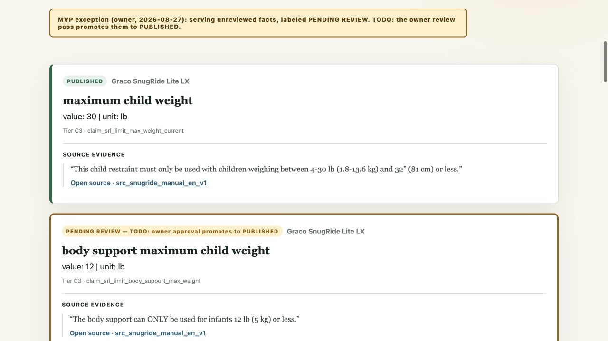
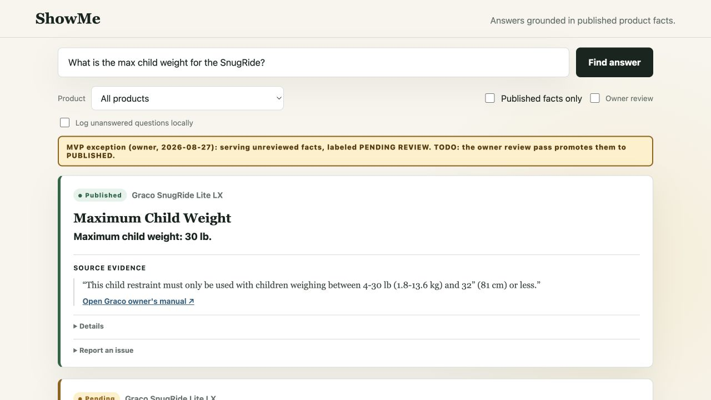
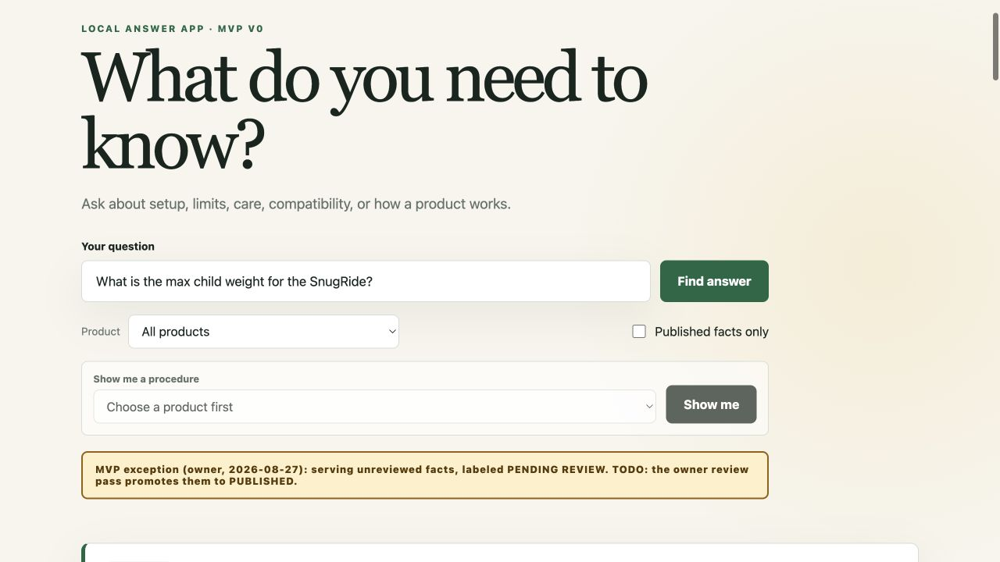
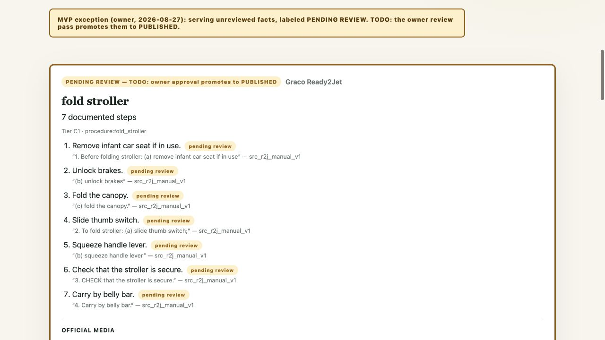
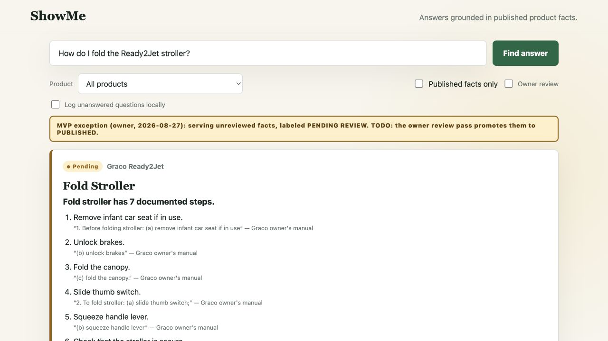

# Answer App v1 UX — Completion Report

**Completed:** 2026-08-28  
**Implementation commit:** `cc2d10d`  
**Result:** all 10 work-order outcomes delivered; no stop-and-report blocker.

## Acceptance summary

- Full suite: **71 passed** (the original 55 plus 16 new tests).
- Evidence validator: **5/5 packs pass**; existing two warnings are unchanged.
- Media validator: **29 bindings pass**, including the new `DERIVED_ASSET` lane.
- Browser QA: passed at **1280×720**. The first SnugRide answer occupies
  `y=315..662`, the search field remains at `y=85..139`, and `scrollY=0`.
- End-to-end review QA: on a disposable fixture pack, a C3 card changed from
  Pending to Published after one explicit click, lost its review controls,
  and remained Published after server restart.
- Policy audit: no `claims.json`, `verdicts.json`, or real `reviews.json`
  record was edited. REJECTED claims still never serve; the labeled MVP
  exception remains the default.

## Chosen implementations

| Item | Choice and reason | Pinned outcome |
|---|---|---|
| 1. Answers read like answers | **Option (b) + (c).** `system/answer.py` now owns deterministic, type-aware `display_text`, so CLI and app cannot drift. Raw projection, tier, and claim ID moved into a closed Details disclosure. | SPEC, LIMIT, WARNING, and STEP renderers are tested. The real SnugRide lead is **“Maximum child weight: 30 lb.”**; quote and human source name remain visible. |
| 2. Owner review mode | **Option (a), without optional progress/bulk UI.** In-context controls minimize reviewer switching. The server accepts writes only with `--reviewer <email>`, appends the existing seven-field record shape through an fsync + atomic replace, and leaves prior records byte-for-byte equivalent in the ledger array. | API and browser tests cover approve, reject, missing identity, restart persistence, immediate status refresh, and rejection of bulk requests. C2/C3 are always one-click-per-claim; composed procedures expose controls per member claim, never for a synthetic procedure ID. |
| 3. Search-first layout | **Collapse the hero after the first query.** A `has-searched` state removes only empty-state copy and the procedure picker, leaving the search form at the top. Later submissions preserve the existing scroll offset. | Browser measurement proves the first card and search box are both visible at 1280×720 with no scroll. A static UI contract pins the class swap and subsequent-search scroll preservation. |
| 4. One honesty banner, quieter chips | **Use the prescribed reduction.** The page banner remains; cards use a dot + one-word chip; step chips render only when a step differs from its card; pending media is folded into its caption. | The fold card has one pending card chip, zero same-status step chips, and zero media approval banners. Quotes and human source names are unchanged. |
| 5. No orphan fragments | **“Step N of Procedure” plus a full-procedure button.** This preserves a precise single-step search result while providing sibling context on demand. | Single-step API output includes step number, readable procedure, and product directory; one click opens the existing ordered procedure player. No bare “procedure step” card title remains. |
| 6. Media and dropdown polish | **Use a registered, same-claim official image as the local video poster** and expose `publication_state` as published/partial/pending. This avoids a new derivative/cache dependency while guaranteeing a visible pre-play image. Only partial procedures receive a suffix. | The Ready2Jet video has `/images/official-fold-sequence.png` as its poster. Its all-pending Fold option is clean; the partly reviewed Secure Child option automatically reads “partially published.” |
| 7. Honest misses and guided starts | **Deterministic gap-token overlap plus three static questions per product.** This keeps the serving path local and reproducible. | “How do I pair accessories with the MacBook Air?” renders the recorded Bluetooth-pairing gap reason. Landing and miss states show three clickable questions that execute a search. |
| 8. Serve derived visuals | **Option (a): `DERIVED_ASSET` media binding.** Reusing media bindings keeps claim traceability and approval gating in one serving lane. The validator requires the registered asset, matching hash, label, provider provenance, owner-only approval, `internal_only`, and an `INTERNAL ONLY` watermark. | “What does the Levoit Core 300S look like?” returns the photo-projected turntable with pending label, visible watermark, label, provenance, and claim evidence. Direct unapproved URLs require `preview=1`; published-only requests do not receive the asset. |
| 9. Feedback intake | **Both per-card reports and opt-in miss logging.** They append bounded records to ignored local `app/feedback.jsonl`; no network or inferred identity is added. | Endpoint tests append a claim report and a null-claim miss to the same JSONL file with UTC timestamps. |
| 10. Ambiguity guard | **The specified clarify payload.** Product identity tokens are distinguished from shared category tokens; tied unnamed category matches return candidates before retrieval. | A two-widget fixture returns “Which product did you mean?” candidates instead of interleaved results. Naming Acme selects only Acme; the one-product-per-category production catalog remains unchanged. |

## Before / after evidence

### Item 1 — answer language

Before: raw storage fields, tier, claim ID, and source ID lead the card.



After: a bold answer sentence leads; internal fields are collapsed; quote and
human source name remain visible.



### Item 3 — search-first fold

Before: after submitting, the hero still consumes the viewport and the first
answer begins below the fold.



After: search remains at the top and the complete first SnugRide card is visible
at 1280×720.


### Item 4 — pending-label fatigue

Before: page banner, full card badge, every-step badge, and raw source IDs repeat
the same state and metadata.



After: one page banner, one compact card chip, no redundant step chips, and
human source names.



## Fresh-server demo

Start locally with the owner identity required for review writes:

```bash
python3 app/server.py --reviewer vijayp.cmu@gmail.com
```

Then run this sequence:

1. **Fold:** “How do I fold the Ready2Jet stroller?” — one ordered seven-step
   card, citations per step, official image/video with poster.
2. **SnugRide:** “What is the max child weight for the SnugRide?” — “Maximum
   child weight: 30 lb.” leads the published card.
3. **Recorded gap:** “How do I pair accessories with the MacBook Air?” — the
   Bluetooth-pairing gap and its recorded reason appear.
4. **Review:** turn on Owner review, choose one pending card, and click Approve
   for publish. The card refreshes immediately as Published without pending
   card labeling; the decision remains after restart.

The app was exercised from a fresh process on port 8877 because port 8765 was
already occupied in the local environment. The disposable review fixture was
also stopped and restarted to prove persistence.

## Remaining known gaps

- Derived turntables remain `approved_by: null`, internal-only, and under open
  imagery/license review. They serve only through the labeled MVP exception and
  keep a visible internal-only watermark; this work does not approve shipment.
- The optional C0/C1 bulk-review feature was intentionally not implemented.
  Every decision is explicit per claim, which is safer and fully satisfies the
  required C2/C3 guardrail.
- Video posters reuse a registered official image bound to the same fold claims
  rather than extracting a new first-frame derivative. This guarantees a stable
  image before play without adding media tooling or weakening provenance.
- Reviewer identity is local CLI configuration, not authentication. That is
  appropriate for the loopback-only app but must not be treated as an internet
  access-control mechanism.
