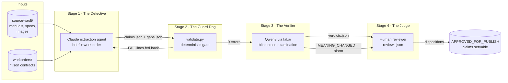
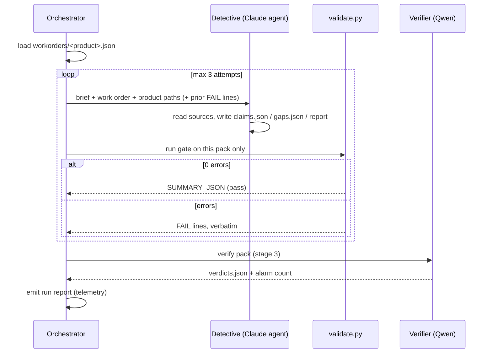
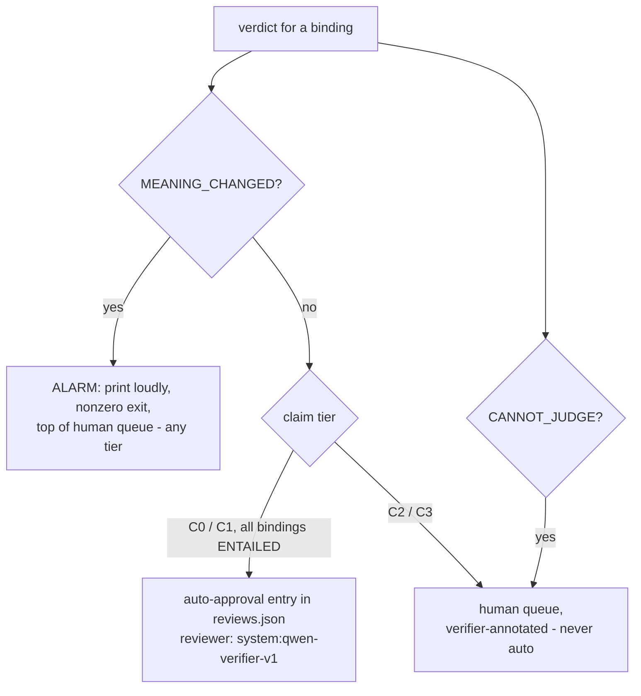

# Work Order: Build the Evidence Extraction System

**Date issued:** 2026-08-24
**For:** a builder (human or agent) with repository access — no prior conversation context assumed
**Depends on:** `evidence-packs/` (5 complete packs, all validating), `source-vault/` (5 products), `docs/planning/extraction-systematization-findings.md` (the experiment that de-risked this build)
**Output:** a pipeline that turns vault sources into human-reviewable, machine-verified claim packs with almost no operator effort

---

## 1. What you are building

A four-stage pipeline that extracts product facts ("claims") from official
sources, mechanically proves nothing was fabricated, cross-examines the
extraction with a *different* AI model, and hands humans a short, ordered
review queue instead of raw JSON.

Every stage already ran once by hand on five real products (356+ claims,
zero fabrications escaping the gate). **You are not designing the system —
you are wrapping proven parts in a driver loop and adding one new stage
(the Verifier).** Where this document and the existing artifacts disagree,
the existing artifacts win; flag the discrepancy instead of improvising.



Why two different AI models: the Detective is Claude. A same-family checker
shares the Detective's blind spots. In this project's own verifier POC,
Qwen3-VL blind-caught a meaning-level error (a wrong-direction fold) that a
Claude judge missed. Independence is the point — do not "simplify" stage 3
onto a Claude model.

## 2. What already exists (reuse, never rebuild)

| Asset | Path | Role |
|---|---|---|
| Agent brief | `evidence-packs/workorders/extraction-agent-brief.md` | The Detective's standing instructions. The orchestrator sends this verbatim. |
| Work orders | `evidence-packs/workorders/<product>.json` | Machine-readable contract per product: claim-type floors, count band, mandated conflicts, checklist. |
| The gate | `evidence-packs/validate.py` | Verifies every quote literally exists in its cited source (PDF page / markdown / HTML), bans estimated bounding boxes, enforces the contract, validates `gaps.json` + `reviews.json`. Exit 0 = pass. Prints one `SUMMARY_JSON:` line per pack. |
| Five packs | `evidence-packs/<product>/` | `claims.json`, `gaps.json`, `extraction-report.md`, some `reviews.json`. Your regression fixtures. |
| Qwen integration precedent | `poc-seedance-keyframe-fold/verify_with_vlm.py` | Working `fal_client` code: endpoint `fal-ai/any-llm/vision`, model `qwen/qwen3-vl-235b-a22b-instruct`, credentials via `.env`. Stage 3 follows this pattern (text endpoint, no images). |
| Vault validator | `scripts/validate_vault.py` | Hashes every manifest entry. You will extend it (§6). |
| CI | `.github/workflows/ci.yml` | Already runs both validators. You will add the new checks. |
| Design rationale | `docs/planning/extraction-systematization-findings.md` §7 | The agreed pipeline spec this work order implements. |

## 3. Binding policies (project law — violating any of these fails review)

1. **CANDIDATE-only.** No stage except a human (or the one auto-approval
   rule in §5.3) ever writes a disposition. Claims are born and stay
   `"status": "CANDIDATE"`; servability lives in `reviews.json`.
2. **Claims are immutable.** Review decisions, verifier verdicts, and gap
   closures are *separate artifacts* (`reviews.json`, `verdicts.json`,
   `gaps.json`). Nothing ever edits or deletes an extracted claim.
3. **Procedures are never skippable.** Every procedure a source documents
   gets extracted. If the count band would overflow, raise the band with a
   `revision_note` — never omit content. Ambiguity is extracted with the
   ambiguity stated in `extraction_notes`, never skipped.
4. **Quotes are verbatim** in the text layer the gate checks. A claim whose
   quote can't be found is treated as fabricated and fails.
5. **Coordinates are never estimated.** `bounding_box` is `null` +
   `annotation_status: "PENDING"` unless actually measured.
6. **Conflicts are recorded, not resolved** by machines. Both claims are
   written with `CONFLICT:` cross-references; humans decide.
7. **Source-authority precedence** (from recorded review decisions):
   owner's manual > official support/spec article > gallery image/overlay.
   Machines may *annotate* with this ordering; only humans rule on it.
8. **Latest revision only.** One manual per retail listing — the current
   hardware revision. Removals are logged in the manifest `curation_log`.
9. **Don't weaken the gate.** `validate.py` checks may be added, never
   relaxed, and the five existing packs must keep passing.

## 4. Deliverables

| # | File | What it is |
|---|---|---|
| D1 | `system/verify_claims.py` | Stage 3: the Qwen Verifier (§5.3). **Build this first — it is useful standalone.** |
| D2 | `system/extract_orchestrator.py` | Stage 1 driver: spawns the Detective per product, feeds gate failures back, loops to green (§5.1). |
| D3 | `system/review_queue.py` | Stage 4 input: renders the ordered human queue per pack (§5.4). |
| D4 | `evidence-packs/validate.py` extension | Gate learns to validate `verdicts.json` (§5.2). |
| D5 | `scripts/validate_vault.py` extension | Intake health: orphan-file check + PDF text-layer check (§6). |
| D6 | `.github/workflows/ci.yml` update | Runs D4/D5 checks; verifier smoke test if secrets allow (§7). |
| D7 | `system/README.md` | One page: how to run each piece, env vars, cost notes. |

Python 3.12, stdlib + `pypdf` + `fal_client` + the Claude Agent SDK
(`claude-agent-sdk`) only. Match the code style of `validate.py`.

## 5. Stage specifications

### 5.1 Stage 1 — the Detective (D2: `extract_orchestrator.py`)

One product = one agent = one output directory. Agents never share files.



Requirements:

- **Agent runtime:** the Claude Agent SDK (`claude-agent-sdk` /
  `@anthropic-ai/claude-agent-sdk` — docs: code.claude.com/docs/en/agent-sdk).
  The Detective needs file reading (including PDFs), bash, and write access
  to exactly one pack directory. The reference runs used precisely this
  harness interactively; you are automating the same invocation.
- **Prompt assembly:** system/task prompt = the verbatim brief file + the
  product's work-order JSON + the resolved paths (vault dir, pack dir) +
  today's date + on retries, the gate's FAIL lines verbatim. Do not
  paraphrase the brief; it is the contract.
- **Staging and atomic promotion (immutability guard):** the Detective
  NEVER writes into the real pack directory. Each attempt writes into a
  fresh staging root `system/staging/<run>/<attempt>/evidence-packs/<product>/`
  that mirrors the repo layout, with symlinks for `source-vault/` and
  `evidence-packs/workorders/` beside it so the gate's relative manifest
  resolution works (the gate already accepts an explicit claims.json path).
  The gate validates the STAGED copy. Only on 0 errors is the staged pack
  promoted into `evidence-packs/<product>/` in one atomic replace. Failed
  attempts leave the real pack untouched, by construction.
- **Retry loop:** max 3 attempts; each retry receives the prior gate FAIL
  lines verbatim. If still failing, stop, discard staging, write the
  failure into the run report — never force, never edit claims yourself.
- **Top-up mode** (`--topup <product>`): same staged flow, but the prompt
  states the pack exists, is append-only, and names what is missing.
  Before spawning, record the SHA-256 of every existing claim element
  (canonical JSON per claim); after promotion, every pre-existing hash
  must be present and unchanged — enforce in code, not by convention.
- **Per-product run states:** the run report records one terminal state
  per product from: `extracted` → `gate_passed` / `gate_failed` →
  `verified` / `verification_partial` / `verification_failed` /
  `alarmed`. An alarm or verifier failure never blocks telemetry or
  queue generation for other products.
- **Telemetry:** collect each pack's `SUMMARY_JSON` line plus attempts
  used, wall time, state, and FAIL lines seen, into
  `system/runs/<timestamp>.json`.

### 5.2 Stage 2 — the Guard Dog (D4: extend `validate.py`)

The gate exists and is trusted — three synthetic traps (fabricated quote,
estimated bbox, wrong-page citation) were proven to hard-fail. Your only
change: when `evidence-packs/<product>/verdicts.json` exists, validate it
against the §5.3 schema exactly:

- Root MUST carry `model`, `prompt_version`, `date`, and `status`
  (`COMPLETE | PARTIAL | FAILED`); entries carry none of these.
- Every `claim_id` exists in the pack; every `binding_index` is a valid
  index into that claim's `source_bindings`.
- Exactly one verdict per `(claim_id, binding_index)` — duplicates and
  out-of-range indexes are hard errors.
- `verdict` is in the enum; `note` is nonempty.
- Coverage: `status: "COMPLETE"` requires a verdict for every text-source
  binding in the pack; `PARTIAL` requires a nonempty root `reason`.
- Count into `SUMMARY_JSON`: `verdicts_recorded`, `meaning_changed`,
  `cannot_judge`, `verification_status`.

Malformed verdicts are hard errors. Do not touch any existing check.

### 5.3 Stage 3 — the Verifier (D1: `verify_claims.py`) — build first

**Model — pinned, not "largest available":** one exact model id in one
constant block, starting value `qwen/qwen3-vl-235b-a22b-instruct` — the id
already proven live in this repo's POC — via fal.ai (`fal-ai/any-llm`
family; the POC used the `/vision` variant, which also accepts text-only
prompts). At M1 start, verify the id is live; if you must substitute,
substitute another exact `qwen/…` id and record it in D7 and in every
`verdicts.json`. A `PROMPT_VERSION` string constant (e.g. `"v1"`) versions
the prompt+schema and is recorded alongside. **Never a Claude/Anthropic
model — independence from the Detective is the design.**

**Input per source binding** — exactly three things, nothing else:

1. the verbatim `quote`
2. the claim's translation: `type`, `predicate`, and the `object` JSON
   (for STEP claims: procedure, step number, action)
3. the consequence tier (context for strictness, stated as such)

**Blind and adversarial.** Never send `extraction_notes`, the extractor's
rationale, other claims, or prior verdicts. Prompt frame (adapt, keep the
adversarial stance and JSON-only output):

> You are a strict verifier auditing a fact extracted from a product
> manual. Below are the EXACT QUOTE from the source and the TRANSLATION a
> different system produced. Assume the translation changed the meaning
> and try to prove it. Small changes matter: a different number, unit,
> direction, actor, condition, or an added/dropped qualifier is a meaning
> change. If the translation adds information the quote does not state,
> that is a meaning change. Answer in JSON only:
> `{"verdict": "ENTAILED" | "MEANING_CHANGED" | "CANNOT_JUDGE",
>   "note": "<one sentence: the discrepancy, or why it is faithful>"}`

**Output:** `evidence-packs/<product>/verdicts.json`:

```json
{
  "model": "qwen/<exact-pinned-model-id>",
  "prompt_version": "v1",
  "date": "<ISO date>",
  "status": "COMPLETE | PARTIAL | FAILED",
  "reason": "<required when status != COMPLETE>",
  "verdicts": [
    {"claim_id": "...", "binding_index": 0,
     "verdict": "ENTAILED | MEANING_CHANGED | CANNOT_JUDGE",
     "note": "..."}
  ],
  "conflict_triage": [
    {"pair": ["claim_id_a", "claim_id_b"],
     "result": "GENUINE_CONFLICT | DIFFERENT_SCOPE_OR_EVENT | CANNOT_JUDGE",
     "note": "...", "context_sha256": "<hash of the page context sent>"}
  ]
}
```

Root fields govern the whole document (finding-proofed: entries do NOT
repeat `model`/`date`). Exactly one verdict per `(claim_id,
binding_index)`; every text-source binding covered or `status: "PARTIAL"`
with a `reason`. The `conflict_triage` array is the destination for the
`--conflicts` job below — advisory only, consumed by `review_queue.py`,
never by any auto-approval path.

**Routing** (the alarm logic — implement exactly):



Auto-approval entries use the existing `reviews.json` schema with
`reviewer: "system:qwen-verifier-v1"`, `scope: "verifier_auto"`, and a
rationale naming the verdict. Never overwrite or contradict an existing
human entry for the same claim — human entries always win; skip and note.

**Mechanics:**

- Skip bindings to image/video sources (mark `CANNOT_JUDGE`, note "visual
  binding"); temperature 0 or provider minimum; retry a malformed JSON
  response once, then `CANNOT_JUDGE`.
- **Cache key — get this exactly right:** a cached verdict is reusable
  only when NOTHING the verifier saw has changed. Key =
  `(claim_id, binding_index, sha256(quote), sha256(canonical JSON of
  type+predicate+object), consequence_tier, model_id, PROMPT_VERSION)`.
  A cache keyed on the quote alone would silently return stale ENTAILED
  after a value mutation — which is precisely what injection test 2
  exists to catch; test 2 must pass WITH the cache warm.
- **Exit codes** (the orchestrator branches on these, and always still
  writes telemetry and the queue): `0` complete, no alarms; `10` complete,
  MEANING_CHANGED alarms present; `20` PARTIAL (some bindings unverified);
  `30` provider/credential failure; `40` malformed provider output after
  retry.
- `--product` flag to run one pack. Expect roughly 450 bindings × a few
  hundred tokens — trivial cost; still print a running count and total
  spend estimate.
- **Provider seam for tests:** all fal calls go through one injectable
  function so tests run against a mocked provider deterministically; one
  separate live canary (`system/tests/live_canary.py`, run manually or in
  CI only when secrets exist) sends a handful of known pairs to the real
  model.

**Second job — conflict triage** (`--conflicts`): for each CONFLICT pair,
send both quotes PLUS ±~500 words of surrounding page text and ask whether
they genuinely contradict or describe different scopes/events/revisions.
Results land in the `conflict_triage` array of that pack's `verdicts.json`
(schema above, including the `context_sha256` of what was sent), and
`review_queue.py` renders them beside the pair. *Advisory annotation
only* (policy 6) — no triage result ever writes a disposition. This job
exists because one of the project's 7 recorded conflicts proved false —
two light-duration figures describing different trigger events, visible
only in page context.

### 5.4 Stage 4 — the Judge (D3: `review_queue.py`)

Renders `evidence-packs/<product>/review-queue.md` from claims + gaps +
verdicts + reviews. Ordering: (1) MEANING_CHANGED alarms, (2) unresolved
CONFLICT pairs with the triage annotation, (3) C3 claims value-vs-quote
side by side, (4) C2, (5) **unresolved-verifier bucket** — C0/C1 claims
with any `CANNOT_JUDGE` binding, plus every claim whose verdict set is
missing or incomplete (`status` PARTIAL/FAILED, or no `verdicts.json`
yet) — nothing auto-approves without a complete all-ENTAILED set, (6)
open gaps, (7) auto-approved list (for spot-audit). Skip anything with an
existing human disposition. Each entry shows claim id, tier, the object,
the quote, verifier note, and the extractor's `extraction_notes` (the
human may see them; the Verifier may not). **Formatting: quotes and
object JSON go in fenced code blocks, never markdown table cells —
several real quotes contain `|` and newlines, which silently break
tables.** A human works top-to-bottom recording decisions in
`reviews.json` by hand or via a `--approve/--reject` helper if you build
one (helper must require `--reviewer <email>` and refuse `system:*`).

## 6. Vault intake hardening (D5: extend `validate_vault.py`)

Two pathologies reached extraction that intake should have caught:

1. **Orphan files:** a file on disk under a product dir with no manifest
   entry (a Bose `specs/specs.md` sat unregistered and invisible to
   extraction for days). Walk each product dir; any file not listed as a
   manifest `local_path` → hard error naming the file — EXCEPT an explicit
   ignore list defined as one constant in the script: the product's own
   `manifest.json`, `.DS_Store`, and nothing else to start. Any other
   control file someone wants to allow gets added to that constant in a
   reviewed change, never special-cased inline.
2. **Unreadable text layer:** a manual PDF whose pages extract to zero
   characters (both original Levoit 300S manual copies — CID fonts). For
   every `local_path` ending `.pdf`, extract text from up to the first 10
   pages with `pypdf`; if ALL sampled pages yield empty text → hard error
   telling the operator the source cannot support quote verification and
   needs OCR or an alternative capture.

Both checks run inside the existing script and keep its output style. The
current vault must pass clean (it does — fix nothing silently; if a check
fires on current data, stop and report).

## 7. Build order, milestones, acceptance

Build in this order; each milestone is independently reviewable.

| M | Deliverables | Acceptance (reviewer runs these) |
|---|---|---|
| M0 | Baseline | **Before any code:** the repo owner commits the current tree (everything is untracked today), OR the builder's first act is writing `system/baseline-hashes.json` — SHA-256 of every `claims.json` element per pack — since a `git diff` against an empty index proves nothing. All later immutability checks compare against this baseline. |
| M1 | D1 + D4 | `python3 system/verify_claims.py` over all 5 packs → 5 `verdicts.json` with `status: COMPLETE`, gate still exits 0, **injection tests below pass — test 2 with a warm cache** |
| M2 | D5 | `python3 scripts/validate_vault.py` → still "vault OK"; injected orphan file and image-only PDF each hard-fail |
| M3 | D2 | `--topup` on a staged scratch copy reaches green ≤3 attempts; pre-existing claim hashes unchanged (verified against M0 baseline); failed-attempt test leaves the real pack untouched; run report written with per-product states |
| M4 | D3 + D6 + D7 | queue renders for all packs with correct ordering incl. the unresolved-verifier bucket; CI green |

**CI wiring (D6, explicit):** add steps that `pip install pypdf fal_client
pytest` (pinned versions in a `system/requirements.txt`), run
`python -m compileall system/ evidence-packs/`, and run
`pytest -q system/tests` with the mocked provider (no secrets needed).
Note the existing workflow only discovers root `tests/test_*.py` — wire
`system/tests` explicitly. The live canary runs only in a separate,
secret-gated job (skips cleanly when `FAL_KEY` is absent).

**Mandatory injection tests** (automate as `system/tests/`, runnable
offline where possible; scratch copies only — never mutate real packs):

1. *Gate regression:* copy a pack, inject (a) a fabricated quote, (b) a
   non-null bbox with `PENDING`, (c) a real quote cited to a wrong page →
   each must FAIL the gate.
2. *Verifier catches meaning drift — cache-proof:* run the verifier on a
   scratch copy (warming the cache), then mutate one claim's
   `object.value` (e.g. 30 → 35) leaving the quote untouched, and run
   again → the mutated binding must be RE-VERIFIED (cache miss, because
   the translation hash is in the key) and return MEANING_CHANGED with
   exit code 10. A cached ENTAILED surviving the mutation fails this test
   and the milestone.
3. *Verifier passes faithful claims:* the unmutated pack → zero
   MEANING_CHANGED (a handful of CANNOT_JUDGE for visual bindings is fine;
   investigate any false alarm before shipping).
4. *Verifier model allowlist:* test asserts the configured verifier model
   id starts with `qwen/` (a positive allowlist — not merely the absence
   of `claude`/`anthropic` in the string).
5. *Auto-approve boundary:* a C3 claim with all-ENTAILED verdicts must NOT
   produce an auto-approval entry; a C0 one must.
6. *Human precedence:* run the verifier twice; a pre-existing human review
   entry is never overwritten.

## 8. Review instructions (for whoever accepts this work)

- Run every acceptance command in §7 yourself; do not accept screenshots.
- Read the diff of `validate.py` and `validate_vault.py` line by line —
  the only acceptable changes are additive checks (§5.2, §6).
- Verify claim immutability against the **M0 baseline** (the committed
  tree, or `system/baseline-hashes.json`): every pre-existing claim's
  hash unchanged after M1/M2/M4, and unchanged-plus-appends after an M3
  top-up. A bare `git diff --stat` is sufficient only once the packs are
  actually tracked in git — today they are not.
- Spot-audit 5 random verdicts per pack against the actual sources: does
  ENTAILED look right? Any MEANING_CHANGED alarm on the real packs is a
  finding — triage it with the builder before shipping (it is either a
  real extraction bug, which is the system working, or a verifier
  false-positive worth a prompt fix).
- Check cost telemetry: a full 5-pack verifier sweep should cost on the
  order of single-digit dollars. Anything larger means bindings are being
  re-sent uncached.
- Reject any change that adds a disposition-writing path other than the
  C0/C1 auto-approve rule and human entries.

## 9. What NOT to do

- Do not use a Claude/Anthropic model for stage 3 — under any framing.
- Do not auto-approve C2/C3, ever.
- Do not edit, reorder, renumber, or delete existing claims.
- Do not relax, remove, or special-case any existing gate check.
- Do not let the Verifier see extractor notes, other claims, or its own
  prior verdicts.
- Do not resolve conflicts in code; annotate them for humans.
- Do not touch `source-vault/` contents except through the D5 validator.
- Do not invent schema fields; extend only where this document specifies.

## 10. Handing the work back

Your closing report states: what was built per milestone, every acceptance
command with its actual output, verdict statistics per pack (ENTAILED /
MEANING_CHANGED / CANNOT_JUDGE counts), any MEANING_CHANGED findings on
real packs with your triage, total verifier spend, and anything this
document got wrong about the repository (with the evidence).
