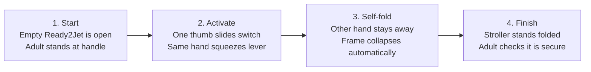

# POC: Can Higgsfield show a real one-hand stroller fold?

## What this POC tests

Can Higgsfield make a short video in which a real person uses the correct
control on one exact stroller and the stroller folds the way the manufacturer
shows?

This is not a test of whether Higgsfield can make an attractive stroller ad.
It is a test of whether the generated motion is accurate enough to answer:

> Can I fold this stroller with one hand?

## Exact product

- Product: **Graco Ready2Jet Stroller**
- Model: **2212125**
- Color selected on the source page: **Splatter Art**
- Official product page: [Graco Ready2Jet model 2212125](https://www.gracobaby.com/shop/strollers/compact-lightweight-strollers/ready2jet-stroller/SAP_2212125.html)
- Official manual: [Ready2Jet owner's manual](https://newellbrands.imgix.net/baef6d42-74d8-3238-a241-b88c8b8bfb18/baef6d42-74d8-3238-a241-b88c8b8bfb18.pdf)

Graco says this model automatically folds to a compact size with one-hand
activation. The manual says the activation is on the stroller handle:

1. Slide the thumb switch.
2. Squeeze the handle lever with the same hand.

Before folding, the manual says to remove an infant car seat if one is being
used, unlock the brakes, and fold the canopy. After folding, check that the
stroller is secure.

## Real references included

| File | What it proves |
|---|---|
| `references/official-open-and-folded.png` | The open and folded appearance of this Ready2Jet product listing. |
| `references/official-fold-sequence.png` | Graco's own three-stage visual of a person activating the self-fold. |
| `references/manual-fold-page-34.png` | Exact handle control and the two activation movements. |
| `references/manual-fold-page-35.png` | Correct folded, self-standing end state. |
| `references/start-frame.png` | The public Graco-derived source frame sent to Higgsfield. |
| `references/end-frame.png` | The official target appearance used to score the result. |

The start frame is a crop of Graco's official sequence image, not an
AI-generated approximation. The public source URL is recorded in
`evidence.json`.

## Visual plan



Camera rule: use one continuous, locked three-quarter side view. The fold
control, the person's free hand, the moving frame, and the final folded stroller
must all remain visible. Do not use a dramatic orbit, cutaway, or beauty shot.

## Run the POC

The existing geometry POC already contains the Higgsfield credentials in its
local `.env`. Do not copy those credentials into this folder or commit them.

Dry run (prints the exact controlled request without submitting it):

```bash
python3 run_poc.py --dry-run --run-label corrected-preview-run-01 --seed 41001
```

Submit one paid generation after exporting `HIGGSFIELD_API_KEY` and
`HIGGSFIELD_API_SECRET`:

```bash
python3 run_corrected_three.py
```

The corrected runner uses Higgsfield's current image-to-video endpoint,
`/v1/image2video/dop`, with `dop-preview`, the live endpoint's only accepted
non-Lite, non-Turbo tier. The official SDK names a `dop-standard` tier, but on
July 22, 2026 the live endpoint rejected that value and accepted only
`dop-lite`, `dop-preview`, and `dop-turbo`. The live endpoint also rejected an
empty `motions` list. The corrected request therefore sends
`enhance_prompt: false` and explicitly supplies the previously injected motion
ID at strength `0.0`. Fixed seeds make the three attempts auditable.

After submission, the runner compares every controlled field against the
server's echoed `input_params`. If Higgsfield changes the prompt, model, seed,
enhancement flag, image, motion ID, or zero strength, the runner saves the
mismatch, attempts to cancel the job, and stops the experiment.

```bash
python3 run_poc.py --run-label corrected-preview-run-01 --seed 41001 --model dop-preview
```

The script saves the submitted prompt, request ID, final response, and video in
`out/`. It never writes the API key or secret to disk.

Run the same test three times. Generative video is stochastic, so one lucky
result is not enough to call the feature dependable.

## Pass/fail checklist

A run passes only if all of these are true:

- The stroller stays recognizably the same Ready2Jet throughout: same four
  wheels, handle, seat, canopy, cup holder, belly bar, basket, hinges, and frame.
- One hand performs both control actions at the handle. The other hand never
  helps push, lift, or fold the stroller.
- The control appears in the correct place: the slide switch and squeeze lever
  in the center of the parent handle.
- The stroller folds automatically after activation. It does not melt, teleport,
  flip, or turn into a different stroller.
- The final folded shape matches Graco's reference closely and stands upright.
- There is no child or infant car seat in the stroller while it folds.
- Hands and fingers remain anatomically plausible and do not pass through the
  handle or frame.
- There is no invented on-screen text, extra product, missing part, or logo
  mutation that changes the instruction.

Use `scorecard.md` for each run. The POC passes only if **3 of 3 runs** pass every
required check.

## How to interpret the result

- **3/3 pass:** Higgsfield is promising for this narrow action when supplied
  with an official start frame and a strict motion plan. Keep a verifier or
  human review before showing generated instructions to users.
- **1/3 or 2/3 pass:** it may be useful as an experimental fallback, but it is
  not dependable enough to answer automatically.
- **0/3 pass:** do not generate this instruction. Retrieve and show Graco's
  existing fold sequence or an official video instead.

Even a passing video does not prove the product supports one-hand folding. The
manufacturer evidence proves that; the generated video only tries to explain it
visually.

## Original run 1 result and caveat

Run 1 on `dop-turbo` failed decisively. The stroller never folded. Higgsfield
changed it into a different open stroller, used both of the adult's hands,
invented red controls, moved the camera, and ended with the stroller open. See
`result-analysis.md`, `out/contact-sheet.png`, and the generated video for the
evidence.

However, the server applied `enhance_prompt: true` and silently injected a
camera-motion preset at strength `1.0`. Run 1 therefore demonstrates unsafe
defaults, not the model's behavior under the exact prompt and a static camera.
It is retained for provenance but excluded from the corrected three-run verdict.

## Corrected three-run result

The corrected experiment completed on July 22, 2026. All three jobs passed the
effective-parameter audit, but all three videos failed the visual scorecard.
None folded the stroller; all three changed it into a different, larger, open
stroller. The controlled verdict is therefore **0/3 pass**. See
`corrected-results.md` and the three `out/corrected-preview-run-*` directories.
